<!-- GENERATED:MODEL -->
---
tags: [odoo, community, generated, model]
---

# pos.order

- Module: [[docs/Community Addons/pos_sale/pos_sale|pos_sale]]
- Scope: Community Addons
- Defined in module: extension only
- Source files: `models/pos_order.py`
- Python classes: `PosOrder`

## Field footprint

- Detected fields: 3
- Field types: `Float` x 1, `Integer` x 1, `Many2one` x 1
- Relation fields: 1

## Sample fields

- `crm_team_id`: `Many2one` (comodel `crm.team`)
- `currency_rate`: `Float` (compute `_compute_currency_rate`, store `True`)
- `sale_order_count`: `Integer` (compute `_count_sale_order`)

## Method hints

- Detected methods: 10
- Action methods: `action_view_sale_order`
- Compute methods: `_compute_currency_rate`
- Onchange methods: none

## Direct relation diagram

```plantuml
@startuml
!define ODOO_COLOR_PRIMARY #714B67
!define ODOO_COLOR_ACCENT #875A7B
!define ODOO_COLOR_BG #FAF7FA

skinparam backgroundColor ODOO_COLOR_BG
skinparam defaultTextAlignment left
skinparam ArrowColor ODOO_COLOR_ACCENT
skinparam ClassBackgroundColor white
skinparam ClassBorderColor ODOO_COLOR_PRIMARY
skinparam ComponentBackgroundColor white
skinparam ComponentBorderColor ODOO_COLOR_PRIMARY
skinparam NoteBackgroundColor #FFF8FF
skinparam NoteBorderColor ODOO_COLOR_ACCENT
skinparam SequenceLifeLineBorderColor ODOO_COLOR_ACCENT
skinparam SequenceLifeLineBackgroundColor #FFFFFF
skinparam SequenceParticipantBorderColor ODOO_COLOR_PRIMARY
skinparam SequenceParticipantBackgroundColor #FFFFFF
skinparam sequence {
  ArrowColor ODOO_COLOR_ACCENT
  ActorBorderColor ODOO_COLOR_PRIMARY
}
title pos.order - Direct Relations
class "pos.order" as pos_order
class "crm.team" as crm_team
pos_order --> crm_team : crm_team_id
@enduml
```

## Navigation

- **Parent:** [[docs/Community Addons/pos_sale/Models]]

<!-- GENERATED:MODEL -->
