<!-- GENERATED:MODEL -->
---
tags: [odoo, community, generated, model]
---

# sale.order.line

- Module: [[docs/Community Addons/pos_sale/pos_sale|pos_sale]]
- Scope: Community Addons
- Defined in module: yes
- Source files: `models/sale_order.py`
- Python classes: `SaleOrderLine`
- Inherits: `pos.load.mixin`

## Field footprint

- Detected fields: 1
- Field types: `One2many` x 1
- Relation fields: 1

## Sample fields

- `pos_order_line_ids`: `One2many` (comodel `pos.order.line`)

## Method hints

- Detected methods: 11
- Action methods: none
- Compute methods: `_compute_name`, `_compute_qty_delivered`, `_compute_qty_invoiced`, `_compute_untaxed_amount_invoiced`
- Onchange methods: none

## Direct relation diagram

```plantuml
@startuml
!define ODOO_COLOR_PRIMARY #714B67
!define ODOO_COLOR_ACCENT #875A7B
!define ODOO_COLOR_BG #FAF7FA

skinparam backgroundColor ODOO_COLOR_BG
skinparam defaultTextAlignment left
skinparam ArrowColor ODOO_COLOR_ACCENT
skinparam ClassBackgroundColor white
skinparam ClassBorderColor ODOO_COLOR_PRIMARY
skinparam ComponentBackgroundColor white
skinparam ComponentBorderColor ODOO_COLOR_PRIMARY
skinparam NoteBackgroundColor #FFF8FF
skinparam NoteBorderColor ODOO_COLOR_ACCENT
skinparam SequenceLifeLineBorderColor ODOO_COLOR_ACCENT
skinparam SequenceLifeLineBackgroundColor #FFFFFF
skinparam SequenceParticipantBorderColor ODOO_COLOR_PRIMARY
skinparam SequenceParticipantBackgroundColor #FFFFFF
skinparam sequence {
  ArrowColor ODOO_COLOR_ACCENT
  ActorBorderColor ODOO_COLOR_PRIMARY
}
title sale.order.line - Direct Relations
class "sale.order.line" as sale_order_line
class "pos.order.line" as pos_order_line
sale_order_line --|> pos_order_line : pos_order_line_ids
@enduml
```

## Navigation

- **Parent:** [[docs/Community Addons/pos_sale/Models]]

<!-- GENERATED:MODEL -->
