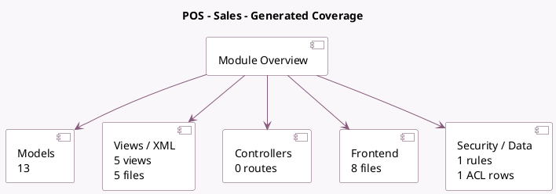

<!-- GENERATED:MODULE -->
---
tags: [odoo, community, module]
---

# POS - Sales

- Scope: Community Addons
- Source: odoo/addons/pos_sale
- Dependencies: [[docs/Community Addons/point_of_sale/point_of_sale|point_of_sale]], [[docs/Community Addons/sale_management/sale_management|sale_management]]

## Summary

Link module between Point of Sale and Sales

## Generated coverage

- Models: 13
- XML files with UI/data artifacts: 5
- Views: 5
- Actions: 1
- Menus: 0
- Rules (ir.rule): 1
- Access CSV entries: 1
- Controller units: 0
- Frontend asset files: 8

## Module map

## Detail notes

- Models: [[docs/Community Addons/pos_sale/Models|Models]] (13)
- Views and XML: [[docs/Community Addons/pos_sale/Views|Views]] (5 files)
- Frontend: [[docs/Community Addons/pos_sale/Frontend|Frontend]] (8 files)

## Key models

- `account.move`
- `crm.team`
- `pos.config`
- `pos.order`
- `pos.order.line`
- `pos.session`
- `product.template`
- `res.config.settings`
- `res.partner`
- `sale.order`
- `sale.order.line`
- `sale.report`

## Navigation

- [[../Community Addons/Community Addons|Back to scope]]
- [[../../docs/docs|Back to docs]]

<!-- GENERATED:MODULE -->

