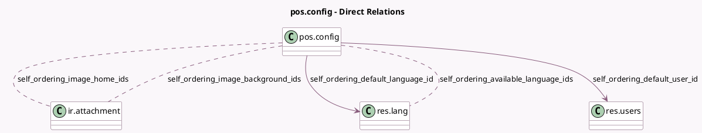

<!-- GENERATED:MODEL -->
---
tags: [odoo, community, generated, model]
---

# pos.config

- Module: [[docs/Community Addons/pos_self_order/pos_self_order|pos_self_order]]
- Scope: Community Addons
- Defined in module: extension only
- Source files: `models/pos_config.py`
- Python classes: `PosConfig`

## Field footprint

- Detected fields: 13
- Field types: `Boolean` x 1, `Char` x 2, `Image` x 1, `Many2many` x 3, `Many2one` x 2, `Selection` x 4
- Relation fields: 5

## Sample fields

- `has_paper`: `Boolean` (comodel `Has paper`)
- `self_ordering_available_language_ids`: `Many2many` (comodel `res.lang`)
- `self_ordering_default_language_id`: `Many2one` (comodel `res.lang`)
- `self_ordering_default_user_id`: `Many2one` (comodel `res.users`)
- `self_ordering_image_background_ids`: `Many2many` (comodel `ir.attachment`)
- `self_ordering_image_brand`: `Image`
- `self_ordering_image_brand_name`: `Char`
- `self_ordering_image_home_ids`: `Many2many` (comodel `ir.attachment`)
- `self_ordering_mode`: `Selection`
- `self_ordering_pay_after`: `Selection`
- `self_ordering_service_mode`: `Selection`
- `self_ordering_url`: `Char` (compute `_compute_self_ordering_url`)
- `status`: `Selection` (compute `_compute_status`, store `False`)

## Method hints

- Detected methods: 33
- Action methods: `action_close_kiosk_session`, `action_open_wizard`
- Compute methods: `_compute_selection_pay_after`, `_compute_self_order`, `_compute_self_ordering_url`, `_compute_status`
- Onchange methods: `_onchange_payment_method_ids`

## Direct relation diagram

## Navigation

- **Parent:** [[docs/Community Addons/pos_self_order/Models]]

<!-- GENERATED:MODEL -->
