<!-- GENERATED:MODEL -->
---
tags: [odoo, community, generated, model]
---

# pos_self_order.custom_link

- Module: [[docs/Community Addons/pos_self_order/pos_self_order|pos_self_order]]
- Scope: Community Addons
- Defined in module: yes
- Source files: `models/pos_self_order_custom_link.py`
- Python classes: `Pos_Self_OrderCustom_Link`
- Description: Custom links that the restaurant can configure to be displayed on the self order screen
- Inherits: `pos.load.mixin`

## Field footprint

- Detected fields: 6
- Field types: `Char` x 2, `Html` x 1, `Integer` x 1, `Many2many` x 1, `Selection` x 1
- Relation fields: 1

## Sample fields

- `link_html`: `Html` (comodel `Preview`, compute `_compute_link_html`, store `True`)
- `name`: `Char`
- `pos_config_ids`: `Many2many` (comodel `pos.config`)
- `sequence`: `Integer` (comodel `Sequence`)
- `style`: `Selection`
- `url`: `Char`

## Method hints

- Detected methods: 3
- Action methods: none
- Compute methods: `_compute_link_html`
- Onchange methods: none

## Direct relation diagram

```plantuml
@startuml
!define ODOO_COLOR_PRIMARY #714B67
!define ODOO_COLOR_ACCENT #875A7B
!define ODOO_COLOR_BG #FAF7FA

skinparam backgroundColor ODOO_COLOR_BG
skinparam defaultTextAlignment left
skinparam ArrowColor ODOO_COLOR_ACCENT
skinparam ClassBackgroundColor white
skinparam ClassBorderColor ODOO_COLOR_PRIMARY
skinparam ComponentBackgroundColor white
skinparam ComponentBorderColor ODOO_COLOR_PRIMARY
skinparam NoteBackgroundColor #FFF8FF
skinparam NoteBorderColor ODOO_COLOR_ACCENT
skinparam SequenceLifeLineBorderColor ODOO_COLOR_ACCENT
skinparam SequenceLifeLineBackgroundColor #FFFFFF
skinparam SequenceParticipantBorderColor ODOO_COLOR_PRIMARY
skinparam SequenceParticipantBackgroundColor #FFFFFF
skinparam sequence {
  ArrowColor ODOO_COLOR_ACCENT
  ActorBorderColor ODOO_COLOR_PRIMARY
}
title pos_self_order.custom_link - Direct Relations
class "pos_self_order.custom_link" as pos_self_order_custom_link
class "pos.config" as pos_config
pos_self_order_custom_link .. pos_config : pos_config_ids
@enduml
```

## Navigation

- **Parent:** [[docs/Community Addons/pos_self_order/Models]]

<!-- GENERATED:MODEL -->
