<!-- GENERATED:MODEL -->
---
tags: [odoo, community, generated, model]
---

# res.config.settings

- Module: [[docs/Community Addons/pos_self_order/pos_self_order|pos_self_order]]
- Scope: Community Addons
- Defined in module: extension only
- Source files: `models/res_config_settings.py`
- Python classes: `ResConfigSettings`

## Field footprint

- Detected fields: 10
- Field types: `Char` x 1, `Image` x 1, `Many2many` x 3, `Many2one` x 2, `Selection` x 3
- Relation fields: 5

## Sample fields

- `pos_self_ordering_available_language_ids`: `Many2many` (related `pos_config_id.self_ordering_available_language_ids`)
- `pos_self_ordering_default_language_id`: `Many2one` (related `pos_config_id.self_ordering_default_language_id`)
- `pos_self_ordering_default_user_id`: `Many2one` (related `pos_config_id.self_ordering_default_user_id`)
- `pos_self_ordering_image_background_ids`: `Many2many` (related `pos_config_id.self_ordering_image_background_ids`)
- `pos_self_ordering_image_brand`: `Image` (related `pos_config_id.self_ordering_image_brand`)
- `pos_self_ordering_image_brand_name`: `Char` (related `pos_config_id.self_ordering_image_brand_name`)
- `pos_self_ordering_image_home_ids`: `Many2many` (related `pos_config_id.self_ordering_image_home_ids`)
- `pos_self_ordering_mode`: `Selection` (related `pos_config_id.self_ordering_mode`)
- `pos_self_ordering_pay_after`: `Selection` (related `pos_config_id.self_ordering_pay_after`)
- `pos_self_ordering_service_mode`: `Selection` (related `pos_config_id.self_ordering_service_mode`)

## Method hints

- Detected methods: 13
- Action methods: none
- Compute methods: `_compute_pos_pricelist_id`
- Onchange methods: `_onchange_default_user`, `_onchange_pos_payment_method_ids`, `_onchange_pos_self_order_kiosk`, `_onchange_pos_self_order_kiosk_default_language`, `_onchange_pos_self_order_pay_after`, `_onchange_pos_self_order_service_mode`

## Direct relation diagram

```plantuml
@startuml
!define ODOO_COLOR_PRIMARY #714B67
!define ODOO_COLOR_ACCENT #875A7B
!define ODOO_COLOR_BG #FAF7FA

skinparam backgroundColor ODOO_COLOR_BG
skinparam defaultTextAlignment left
skinparam ArrowColor ODOO_COLOR_ACCENT
skinparam ClassBackgroundColor white
skinparam ClassBorderColor ODOO_COLOR_PRIMARY
skinparam ComponentBackgroundColor white
skinparam ComponentBorderColor ODOO_COLOR_PRIMARY
skinparam NoteBackgroundColor #FFF8FF
skinparam NoteBorderColor ODOO_COLOR_ACCENT
skinparam SequenceLifeLineBorderColor ODOO_COLOR_ACCENT
skinparam SequenceLifeLineBackgroundColor #FFFFFF
skinparam SequenceParticipantBorderColor ODOO_COLOR_PRIMARY
skinparam SequenceParticipantBackgroundColor #FFFFFF
skinparam sequence {
  ArrowColor ODOO_COLOR_ACCENT
  ActorBorderColor ODOO_COLOR_PRIMARY
}
title res.config.settings - Direct Relations
class "res.config.settings" as res_config_settings
@enduml
```

## Navigation

- **Parent:** [[docs/Community Addons/pos_self_order/Models]]

<!-- GENERATED:MODEL -->
