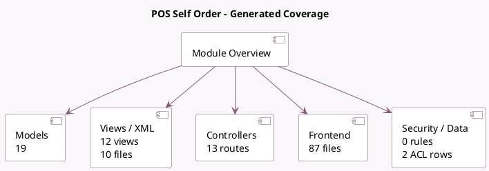

<!-- GENERATED:MODULE -->
---
tags: [odoo, community, module]
---

# POS Self Order

- Scope: Community Addons
- Source: odoo/addons/pos_self_order
- Dependencies: [[docs/Community Addons/pos_restaurant/pos_restaurant|pos_restaurant]], [[docs/Community Addons/http_routing/http_routing|http_routing]], [[docs/Community Addons/link_tracker/link_tracker|link_tracker]]

## Summary

Addon for the POS App that allows customers to view the menu on their smartphone.

## Generated coverage

- Models: 19
- XML files with UI/data artifacts: 10
- Views: 12
- Actions: 2
- Menus: 0
- Rules (ir.rule): 0
- Access CSV entries: 2
- Controller units: 3
- Frontend asset files: 87

## Module map

## Detail notes

- Models: [[docs/Community Addons/pos_self_order/Models|Models]] (19)
- Views and XML: [[docs/Community Addons/pos_self_order/Views|Views]] (10 files)
- Controllers: [[docs/Community Addons/pos_self_order/Controllers|Controllers]] (3)
- Frontend: [[docs/Community Addons/pos_self_order/Frontend|Frontend]] (87 files)

## Key models

- `ir.http`
- `mail.template`
- `pos.category`
- `pos.config`
- `pos.load.mixin`
- `pos.order`
- `pos.order.line`
- `pos.payment.method`
- `pos.preset`
- `pos.session`
- `pos_self_order.custom_link`
- `product.product`

## Navigation

- [[../Community Addons/Community Addons|Back to scope]]
- [[../../docs/docs|Back to docs]]

<!-- GENERATED:MODULE -->

