<!-- GENERATED:MODEL -->
---
tags: [odoo, community, generated, model]
---

# privacy.log

- Module: [[docs/Community Addons/privacy_lookup/privacy_lookup|privacy_lookup]]
- Scope: Community Addons
- Defined in module: yes
- Source files: `models/privacy_log.py`
- Python classes: `PrivacyLog`
- Description: Privacy Log

## Field footprint

- Detected fields: 7
- Field types: `Char` x 2, `Datetime` x 1, `Many2one` x 1, `Text` x 3
- Relation fields: 1

## Sample fields

- `additional_note`: `Text`
- `anonymized_email`: `Char`
- `anonymized_name`: `Char`
- `date`: `Datetime`
- `execution_details`: `Text`
- `records_description`: `Text`
- `user_id`: `Many2one` (comodel `res.users`)

## Method hints

- Detected methods: 3
- Action methods: none
- Compute methods: none
- Onchange methods: none

## Direct relation diagram

```plantuml
@startuml
!define ODOO_COLOR_PRIMARY #714B67
!define ODOO_COLOR_ACCENT #875A7B
!define ODOO_COLOR_BG #FAF7FA

skinparam backgroundColor ODOO_COLOR_BG
skinparam defaultTextAlignment left
skinparam ArrowColor ODOO_COLOR_ACCENT
skinparam ClassBackgroundColor white
skinparam ClassBorderColor ODOO_COLOR_PRIMARY
skinparam ComponentBackgroundColor white
skinparam ComponentBorderColor ODOO_COLOR_PRIMARY
skinparam NoteBackgroundColor #FFF8FF
skinparam NoteBorderColor ODOO_COLOR_ACCENT
skinparam SequenceLifeLineBorderColor ODOO_COLOR_ACCENT
skinparam SequenceLifeLineBackgroundColor #FFFFFF
skinparam SequenceParticipantBorderColor ODOO_COLOR_PRIMARY
skinparam SequenceParticipantBackgroundColor #FFFFFF
skinparam sequence {
  ArrowColor ODOO_COLOR_ACCENT
  ActorBorderColor ODOO_COLOR_PRIMARY
}
title privacy.log - Direct Relations
class "privacy.log" as privacy_log
class "res.users" as res_users
privacy_log --> res_users : user_id
@enduml
```

## Navigation

- **Parent:** [[docs/Community Addons/privacy_lookup/Models]]

<!-- GENERATED:MODEL -->
