<!-- GENERATED:MODEL -->
---
tags: [odoo, community, generated, model]
---

# privacy.lookup.wizard.line

- Module: [[docs/Community Addons/privacy_lookup/privacy_lookup|privacy_lookup]]
- Scope: Community Addons
- Defined in module: yes
- Source files: `wizard/privacy_lookup_wizard.py`
- Python classes: `PrivacyLookupWizardLine`
- Description: Privacy Lookup Wizard Line

## Field footprint

- Detected fields: 10
- Field types: `Boolean` x 3, `Char` x 3, `Integer` x 1, `Many2one` x 2, `Reference` x 1
- Relation fields: 2

## Sample fields

- `execution_details`: `Char`
- `has_active`: `Boolean` (compute `_compute_has_active`, store `True`)
- `is_active`: `Boolean`
- `is_unlinked`: `Boolean`
- `res_id`: `Integer`
- `res_model`: `Char` (related `res_model_id.model`, store `True`)
- `res_model_id`: `Many2one` (comodel `ir.model`)
- `res_name`: `Char` (compute `_compute_res_name`, store `True`)
- `resource_ref`: `Reference` (compute `_compute_resource_ref`)
- `wizard_id`: `Many2one` (comodel `privacy.lookup.wizard`)

## Method hints

- Detected methods: 10
- Action methods: `action_archive_all`, `action_open_record`, `action_unlink`, `action_unlink_all`
- Compute methods: `_compute_has_active`, `_compute_res_name`, `_compute_resource_ref`
- Onchange methods: `_onchange_is_active`

## Direct relation diagram

```plantuml
@startuml
!define ODOO_COLOR_PRIMARY #714B67
!define ODOO_COLOR_ACCENT #875A7B
!define ODOO_COLOR_BG #FAF7FA

skinparam backgroundColor ODOO_COLOR_BG
skinparam defaultTextAlignment left
skinparam ArrowColor ODOO_COLOR_ACCENT
skinparam ClassBackgroundColor white
skinparam ClassBorderColor ODOO_COLOR_PRIMARY
skinparam ComponentBackgroundColor white
skinparam ComponentBorderColor ODOO_COLOR_PRIMARY
skinparam NoteBackgroundColor #FFF8FF
skinparam NoteBorderColor ODOO_COLOR_ACCENT
skinparam SequenceLifeLineBorderColor ODOO_COLOR_ACCENT
skinparam SequenceLifeLineBackgroundColor #FFFFFF
skinparam SequenceParticipantBorderColor ODOO_COLOR_PRIMARY
skinparam SequenceParticipantBackgroundColor #FFFFFF
skinparam sequence {
  ArrowColor ODOO_COLOR_ACCENT
  ActorBorderColor ODOO_COLOR_PRIMARY
}
title privacy.lookup.wizard.line - Direct Relations
class "privacy.lookup.wizard.line" as privacy_lookup_wizard_line
class "ir.model" as ir_model
class "privacy.lookup.wizard" as privacy_lookup_wizard
privacy_lookup_wizard_line --> privacy_lookup_wizard : wizard_id
privacy_lookup_wizard_line --> ir_model : res_model_id
@enduml
```

## Navigation

- **Parent:** [[docs/Community Addons/privacy_lookup/Models]]

<!-- GENERATED:MODEL -->
