<!-- GENERATED:MODEL -->
---
tags: [odoo, community, generated, model]
---

# privacy.lookup.wizard

- Module: [[docs/Community Addons/privacy_lookup/privacy_lookup|privacy_lookup]]
- Scope: Community Addons
- Defined in module: yes
- Source files: `wizard/privacy_lookup_wizard.py`
- Python classes: `PrivacyLookupWizard`
- Description: Privacy Lookup Wizard

## Field footprint

- Detected fields: 7
- Field types: `Char` x 2, `Integer` x 1, `Many2one` x 1, `One2many` x 1, `Text` x 2
- Relation fields: 2

## Sample fields

- `email`: `Char`
- `execution_details`: `Text` (compute `_compute_execution_details`, store `True`)
- `line_count`: `Integer` (compute `_compute_line_count`)
- `line_ids`: `One2many` (comodel `privacy.lookup.wizard.line`)
- `log_id`: `Many2one` (comodel `privacy.log`)
- `name`: `Char`
- `records_description`: `Text` (compute `_compute_records_description`)

## Method hints

- Detected methods: 9
- Action methods: `action_lookup`, `action_open_lines`
- Compute methods: `_compute_display_name`, `_compute_execution_details`, `_compute_line_count`, `_compute_records_description`
- Onchange methods: none

## Direct relation diagram

```plantuml
@startuml
!define ODOO_COLOR_PRIMARY #714B67
!define ODOO_COLOR_ACCENT #875A7B
!define ODOO_COLOR_BG #FAF7FA

skinparam backgroundColor ODOO_COLOR_BG
skinparam defaultTextAlignment left
skinparam ArrowColor ODOO_COLOR_ACCENT
skinparam ClassBackgroundColor white
skinparam ClassBorderColor ODOO_COLOR_PRIMARY
skinparam ComponentBackgroundColor white
skinparam ComponentBorderColor ODOO_COLOR_PRIMARY
skinparam NoteBackgroundColor #FFF8FF
skinparam NoteBorderColor ODOO_COLOR_ACCENT
skinparam SequenceLifeLineBorderColor ODOO_COLOR_ACCENT
skinparam SequenceLifeLineBackgroundColor #FFFFFF
skinparam SequenceParticipantBorderColor ODOO_COLOR_PRIMARY
skinparam SequenceParticipantBackgroundColor #FFFFFF
skinparam sequence {
  ArrowColor ODOO_COLOR_ACCENT
  ActorBorderColor ODOO_COLOR_PRIMARY
}
title privacy.lookup.wizard - Direct Relations
class "privacy.lookup.wizard" as privacy_lookup_wizard
class "privacy.log" as privacy_log
class "privacy.lookup.wizard.line" as privacy_lookup_wizard_line
privacy_lookup_wizard --|> privacy_lookup_wizard_line : line_ids
privacy_lookup_wizard --> privacy_log : log_id
@enduml
```

## Navigation

- **Parent:** [[docs/Community Addons/privacy_lookup/Models]]

<!-- GENERATED:MODEL -->
