<!-- GENERATED:MODEL -->
---
tags: [odoo, community, generated, model]
---

# product.attribute.custom.value

- Module: [[docs/Community Addons/product/product|product]]
- Scope: Community Addons
- Defined in module: yes
- Source files: `models/product_attribute_custom_value.py`
- Python classes: `ProductAttributeCustomValue`
- Description: Product Attribute Custom Value

## Field footprint

- Detected fields: 3
- Field types: `Char` x 2, `Many2one` x 1
- Relation fields: 1

## Sample fields

- `custom_product_template_attribute_value_id`: `Many2one` (comodel `product.template.attribute.value`)
- `custom_value`: `Char`
- `name`: `Char` (compute `_compute_name`)

## Method hints

- Detected methods: 1
- Action methods: none
- Compute methods: `_compute_name`
- Onchange methods: none

## Direct relation diagram

```plantuml
@startuml
!define ODOO_COLOR_PRIMARY #714B67
!define ODOO_COLOR_ACCENT #875A7B
!define ODOO_COLOR_BG #FAF7FA

skinparam backgroundColor ODOO_COLOR_BG
skinparam defaultTextAlignment left
skinparam ArrowColor ODOO_COLOR_ACCENT
skinparam ClassBackgroundColor white
skinparam ClassBorderColor ODOO_COLOR_PRIMARY
skinparam ComponentBackgroundColor white
skinparam ComponentBorderColor ODOO_COLOR_PRIMARY
skinparam NoteBackgroundColor #FFF8FF
skinparam NoteBorderColor ODOO_COLOR_ACCENT
skinparam SequenceLifeLineBorderColor ODOO_COLOR_ACCENT
skinparam SequenceLifeLineBackgroundColor #FFFFFF
skinparam SequenceParticipantBorderColor ODOO_COLOR_PRIMARY
skinparam SequenceParticipantBackgroundColor #FFFFFF
skinparam sequence {
  ArrowColor ODOO_COLOR_ACCENT
  ActorBorderColor ODOO_COLOR_PRIMARY
}
title product.attribute.custom.value - Direct Relations
class "product.attribute.custom.value" as product_attribute_custom_value
class "product.template.attribute.value" as product_template_attribute_value
product_attribute_custom_value --> product_template_attribute_value : custom_product_template_attribute_value_id
@enduml
```

## Navigation

- **Parent:** [[docs/Community Addons/product/Models]]

<!-- GENERATED:MODEL -->
