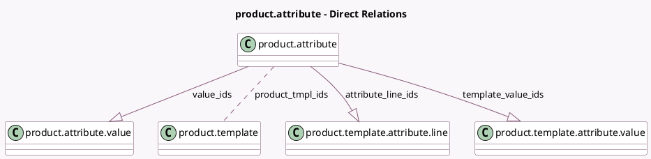

<!-- GENERATED:MODEL -->
---
tags: [odoo, community, generated, model]
---

# product.attribute

- Module: [[docs/Community Addons/product/product|product]]
- Scope: Community Addons
- Defined in module: yes
- Source files: `models/product_attribute.py`
- Python classes: `ProductAttribute`
- Description: Product Attribute

## Field footprint

- Detected fields: 10
- Field types: `Boolean` x 1, `Char` x 1, `Integer` x 2, `Many2many` x 1, `One2many` x 3, `Selection` x 2
- Relation fields: 4

## Sample fields

- `active`: `Boolean`
- `attribute_line_ids`: `One2many` (comodel `product.template.attribute.line`)
- `create_variant`: `Selection`
- `display_type`: `Selection`
- `name`: `Char`
- `number_related_products`: `Integer` (compute `_compute_number_related_products`)
- `product_tmpl_ids`: `Many2many` (comodel `product.template`, compute `_compute_products`, store `True`)
- `sequence`: `Integer`
- `template_value_ids`: `One2many` (comodel `product.template.attribute.value`)
- `value_ids`: `One2many` (comodel `product.attribute.value`)

## Method hints

- Detected methods: 8
- Action methods: `action_archive`, `action_open_product_template_attribute_lines`
- Compute methods: `_compute_number_related_products`, `_compute_products`
- Onchange methods: `_onchange_display_type`

## Direct relation diagram

## Navigation

- **Parent:** [[docs/Community Addons/product/Models]]

<!-- GENERATED:MODEL -->
