<!-- GENERATED:MODEL -->
---
tags: [odoo, community, generated, model]
---

# product.attribute.value

- Module: [[docs/Community Addons/product/product|product]]
- Scope: Community Addons
- Defined in module: yes
- Source files: `models/product_attribute_value.py`
- Python classes: `ProductAttributeValue`
- Description: Attribute Value

## Field footprint

- Detected fields: 13
- Field types: `Boolean` x 4, `Char` x 2, `Float` x 1, `Image` x 1, `Integer` x 2, `Many2many` x 1, `Many2one` x 1, `Selection` x 1
- Relation fields: 2

## Sample fields

- `active`: `Boolean`
- `attribute_id`: `Many2one` (comodel `product.attribute`)
- `color`: `Integer`
- `default_extra_price`: `Float`
- `default_extra_price_changed`: `Boolean` (compute `_compute_default_extra_price_changed`)
- `display_type`: `Selection` (related `attribute_id.display_type`)
- `html_color`: `Char`
- `image`: `Image`
- `is_custom`: `Boolean`
- `is_used_on_products`: `Boolean` (compute `_compute_is_used_on_products`)
- `name`: `Char`
- `pav_attribute_line_ids`: `Many2many` (comodel `product.template.attribute.line`)
- `sequence`: `Integer`

## Method hints

- Detected methods: 11
- Action methods: `action_add_to_products`, `action_update_prices`
- Compute methods: `_compute_default_extra_price_changed`, `_compute_display_name`, `_compute_is_used_on_products`
- Onchange methods: none

## Direct relation diagram

```plantuml
@startuml
!define ODOO_COLOR_PRIMARY #714B67
!define ODOO_COLOR_ACCENT #875A7B
!define ODOO_COLOR_BG #FAF7FA

skinparam backgroundColor ODOO_COLOR_BG
skinparam defaultTextAlignment left
skinparam ArrowColor ODOO_COLOR_ACCENT
skinparam ClassBackgroundColor white
skinparam ClassBorderColor ODOO_COLOR_PRIMARY
skinparam ComponentBackgroundColor white
skinparam ComponentBorderColor ODOO_COLOR_PRIMARY
skinparam NoteBackgroundColor #FFF8FF
skinparam NoteBorderColor ODOO_COLOR_ACCENT
skinparam SequenceLifeLineBorderColor ODOO_COLOR_ACCENT
skinparam SequenceLifeLineBackgroundColor #FFFFFF
skinparam SequenceParticipantBorderColor ODOO_COLOR_PRIMARY
skinparam SequenceParticipantBackgroundColor #FFFFFF
skinparam sequence {
  ArrowColor ODOO_COLOR_ACCENT
  ActorBorderColor ODOO_COLOR_PRIMARY
}
title product.attribute.value - Direct Relations
class "product.attribute.value" as product_attribute_value
class "product.attribute" as product_attribute
class "product.template.attribute.line" as product_template_attribute_line
product_attribute_value --> product_attribute : attribute_id
product_attribute_value .. product_template_attribute_line : pav_attribute_line_ids
@enduml
```

## Navigation

- **Parent:** [[docs/Community Addons/product/Models]]

<!-- GENERATED:MODEL -->
