<!-- GENERATED:MODEL -->
---
tags: [odoo, community, generated, model]
---

# product.category

- Module: [[docs/Community Addons/product/product|product]]
- Scope: Community Addons
- Defined in module: yes
- Source files: `models/product_category.py`
- Python classes: `ProductCategory`
- Description: Product Category
- Inherits: `mail.thread`

## Field footprint

- Detected fields: 7
- Field types: `Char` x 3, `Integer` x 1, `Many2one` x 1, `One2many` x 1, `PropertiesDefinition` x 1
- Relation fields: 2

## Sample fields

- `child_id`: `One2many` (comodel `product.category`)
- `complete_name`: `Char` (comodel `Complete Name`, compute `_compute_complete_name`, store `True`)
- `name`: `Char` (comodel `Name`)
- `parent_id`: `Many2one` (comodel `product.category`)
- `parent_path`: `Char`
- `product_count`: `Integer` (comodel `# Products`, compute `_compute_product_count`)
- `product_properties_definition`: `PropertiesDefinition` (comodel `Product Properties`)

## Method hints

- Detected methods: 5
- Action methods: none
- Compute methods: `_compute_complete_name`, `_compute_display_name`, `_compute_product_count`
- Onchange methods: none

## Direct relation diagram

```plantuml
@startuml
!define ODOO_COLOR_PRIMARY #714B67
!define ODOO_COLOR_ACCENT #875A7B
!define ODOO_COLOR_BG #FAF7FA

skinparam backgroundColor ODOO_COLOR_BG
skinparam defaultTextAlignment left
skinparam ArrowColor ODOO_COLOR_ACCENT
skinparam ClassBackgroundColor white
skinparam ClassBorderColor ODOO_COLOR_PRIMARY
skinparam ComponentBackgroundColor white
skinparam ComponentBorderColor ODOO_COLOR_PRIMARY
skinparam NoteBackgroundColor #FFF8FF
skinparam NoteBorderColor ODOO_COLOR_ACCENT
skinparam SequenceLifeLineBorderColor ODOO_COLOR_ACCENT
skinparam SequenceLifeLineBackgroundColor #FFFFFF
skinparam SequenceParticipantBorderColor ODOO_COLOR_PRIMARY
skinparam SequenceParticipantBackgroundColor #FFFFFF
skinparam sequence {
  ArrowColor ODOO_COLOR_ACCENT
  ActorBorderColor ODOO_COLOR_PRIMARY
}
title product.category - Direct Relations
class "product.category" as product_category
class "product.category" as product_category
product_category --> product_category : parent_id
product_category --|> product_category : child_id
@enduml
```

## Navigation

- **Parent:** [[docs/Community Addons/product/Models]]

<!-- GENERATED:MODEL -->
