<!-- GENERATED:MODEL -->
---
tags: [odoo, community, generated, model]
---

# product.combo.item

- Module: [[docs/Community Addons/product/product|product]]
- Scope: Community Addons
- Defined in module: yes
- Source files: `models/product_combo_item.py`
- Python classes: `ProductComboItem`
- Description: Product Combo Item

## Field footprint

- Detected fields: 6
- Field types: `Float` x 2, `Many2one` x 4
- Relation fields: 4

## Sample fields

- `combo_id`: `Many2one` (comodel `product.combo`)
- `company_id`: `Many2one` (related `combo_id.company_id`, store `True`)
- `currency_id`: `Many2one` (comodel `res.currency`, related `product_id.currency_id`)
- `extra_price`: `Float`
- `lst_price`: `Float` (related `product_id.lst_price`)
- `product_id`: `Many2one` (comodel `product.product`)

## Method hints

- Detected methods: 1
- Action methods: none
- Compute methods: none
- Onchange methods: none

## Direct relation diagram

```plantuml
@startuml
!define ODOO_COLOR_PRIMARY #714B67
!define ODOO_COLOR_ACCENT #875A7B
!define ODOO_COLOR_BG #FAF7FA

skinparam backgroundColor ODOO_COLOR_BG
skinparam defaultTextAlignment left
skinparam ArrowColor ODOO_COLOR_ACCENT
skinparam ClassBackgroundColor white
skinparam ClassBorderColor ODOO_COLOR_PRIMARY
skinparam ComponentBackgroundColor white
skinparam ComponentBorderColor ODOO_COLOR_PRIMARY
skinparam NoteBackgroundColor #FFF8FF
skinparam NoteBorderColor ODOO_COLOR_ACCENT
skinparam SequenceLifeLineBorderColor ODOO_COLOR_ACCENT
skinparam SequenceLifeLineBackgroundColor #FFFFFF
skinparam SequenceParticipantBorderColor ODOO_COLOR_PRIMARY
skinparam SequenceParticipantBackgroundColor #FFFFFF
skinparam sequence {
  ArrowColor ODOO_COLOR_ACCENT
  ActorBorderColor ODOO_COLOR_PRIMARY
}
title product.combo.item - Direct Relations
class "product.combo.item" as product_combo_item
class "product.combo" as product_combo
class "product.product" as product_product
class "res.currency" as res_currency
product_combo_item --> product_combo : combo_id
product_combo_item --> product_product : product_id
product_combo_item --> res_currency : currency_id
@enduml
```

## Navigation

- **Parent:** [[docs/Community Addons/product/Models]]

<!-- GENERATED:MODEL -->
