<!-- GENERATED:MODEL -->
---
tags: [odoo, community, generated, model]
---

# product.combo

- Module: [[docs/Community Addons/product/product|product]]
- Scope: Community Addons
- Defined in module: yes
- Source files: `models/product_combo.py`
- Python classes: `ProductCombo`
- Description: Product Combo

## Field footprint

- Detected fields: 7
- Field types: `Char` x 1, `Float` x 1, `Integer` x 2, `Many2one` x 2, `One2many` x 1
- Relation fields: 3

## Sample fields

- `base_price`: `Float` (compute `_compute_base_price`)
- `combo_item_count`: `Integer` (compute `_compute_combo_item_count`)
- `combo_item_ids`: `One2many` (comodel `product.combo.item`)
- `company_id`: `Many2one` (comodel `res.company`)
- `currency_id`: `Many2one` (comodel `res.currency`, compute `_compute_currency_id`)
- `name`: `Char`
- `sequence`: `Integer`

## Method hints

- Detected methods: 6
- Action methods: none
- Compute methods: `_compute_base_price`, `_compute_combo_item_count`, `_compute_currency_id`
- Onchange methods: none

## Direct relation diagram

```plantuml
@startuml
!define ODOO_COLOR_PRIMARY #714B67
!define ODOO_COLOR_ACCENT #875A7B
!define ODOO_COLOR_BG #FAF7FA

skinparam backgroundColor ODOO_COLOR_BG
skinparam defaultTextAlignment left
skinparam ArrowColor ODOO_COLOR_ACCENT
skinparam ClassBackgroundColor white
skinparam ClassBorderColor ODOO_COLOR_PRIMARY
skinparam ComponentBackgroundColor white
skinparam ComponentBorderColor ODOO_COLOR_PRIMARY
skinparam NoteBackgroundColor #FFF8FF
skinparam NoteBorderColor ODOO_COLOR_ACCENT
skinparam SequenceLifeLineBorderColor ODOO_COLOR_ACCENT
skinparam SequenceLifeLineBackgroundColor #FFFFFF
skinparam SequenceParticipantBorderColor ODOO_COLOR_PRIMARY
skinparam SequenceParticipantBackgroundColor #FFFFFF
skinparam sequence {
  ArrowColor ODOO_COLOR_ACCENT
  ActorBorderColor ODOO_COLOR_PRIMARY
}
title product.combo - Direct Relations
class "product.combo" as product_combo
class "product.combo.item" as product_combo_item
class "res.company" as res_company
class "res.currency" as res_currency
product_combo --> res_company : company_id
product_combo --|> product_combo_item : combo_item_ids
product_combo --> res_currency : currency_id
@enduml
```

## Navigation

- **Parent:** [[docs/Community Addons/product/Models]]

<!-- GENERATED:MODEL -->
