<!-- GENERATED:MODEL -->
---
tags: [odoo, community, generated, model]
---

# product.document

- Module: [[docs/Community Addons/product/product|product]]
- Scope: Community Addons
- Defined in module: yes
- Source files: `models/product_document.py`
- Python classes: `ProductDocument`
- Description: Product Document

## Field footprint

- Detected fields: 3
- Field types: `Boolean` x 1, `Integer` x 1, `Many2one` x 1
- Relation fields: 1

## Sample fields

- `active`: `Boolean`
- `ir_attachment_id`: `Many2one` (comodel `ir.attachment`)
- `sequence`: `Integer`

## Method hints

- Detected methods: 4
- Action methods: none
- Compute methods: none
- Onchange methods: `_onchange_url`

## Direct relation diagram

```plantuml
@startuml
!define ODOO_COLOR_PRIMARY #714B67
!define ODOO_COLOR_ACCENT #875A7B
!define ODOO_COLOR_BG #FAF7FA

skinparam backgroundColor ODOO_COLOR_BG
skinparam defaultTextAlignment left
skinparam ArrowColor ODOO_COLOR_ACCENT
skinparam ClassBackgroundColor white
skinparam ClassBorderColor ODOO_COLOR_PRIMARY
skinparam ComponentBackgroundColor white
skinparam ComponentBorderColor ODOO_COLOR_PRIMARY
skinparam NoteBackgroundColor #FFF8FF
skinparam NoteBorderColor ODOO_COLOR_ACCENT
skinparam SequenceLifeLineBorderColor ODOO_COLOR_ACCENT
skinparam SequenceLifeLineBackgroundColor #FFFFFF
skinparam SequenceParticipantBorderColor ODOO_COLOR_PRIMARY
skinparam SequenceParticipantBackgroundColor #FFFFFF
skinparam sequence {
  ArrowColor ODOO_COLOR_ACCENT
  ActorBorderColor ODOO_COLOR_PRIMARY
}
title product.document - Direct Relations
class "product.document" as product_document
class "ir.attachment" as ir_attachment
product_document --> ir_attachment : ir_attachment_id
@enduml
```

## Navigation

- **Parent:** [[docs/Community Addons/product/Models]]

<!-- GENERATED:MODEL -->
