<!-- GENERATED:MODEL -->
---
tags: [odoo, community, generated, model]
---

# product.label.layout

- Module: [[docs/Community Addons/product/product|product]]
- Scope: Community Addons
- Defined in module: yes
- Source files: `wizard/product_label_layout.py`
- Python classes: `ProductLabelLayout`
- Description: Choose the sheet layout to print the labels

## Field footprint

- Detected fields: 8
- Field types: `Html` x 1, `Integer` x 3, `Many2many` x 2, `Many2one` x 1, `Selection` x 1
- Relation fields: 3

## Sample fields

- `columns`: `Integer` (compute `_compute_dimensions`)
- `custom_quantity`: `Integer` (comodel `Copies`)
- `extra_html`: `Html` (comodel `Extra Content`)
- `pricelist_id`: `Many2one` (comodel `product.pricelist`)
- `print_format`: `Selection`
- `product_ids`: `Many2many` (comodel `product.product`)
- `product_tmpl_ids`: `Many2many` (comodel `product.template`)
- `rows`: `Integer` (compute `_compute_dimensions`)

## Method hints

- Detected methods: 3
- Action methods: none
- Compute methods: `_compute_dimensions`
- Onchange methods: none

## Direct relation diagram

```plantuml
@startuml
!define ODOO_COLOR_PRIMARY #714B67
!define ODOO_COLOR_ACCENT #875A7B
!define ODOO_COLOR_BG #FAF7FA

skinparam backgroundColor ODOO_COLOR_BG
skinparam defaultTextAlignment left
skinparam ArrowColor ODOO_COLOR_ACCENT
skinparam ClassBackgroundColor white
skinparam ClassBorderColor ODOO_COLOR_PRIMARY
skinparam ComponentBackgroundColor white
skinparam ComponentBorderColor ODOO_COLOR_PRIMARY
skinparam NoteBackgroundColor #FFF8FF
skinparam NoteBorderColor ODOO_COLOR_ACCENT
skinparam SequenceLifeLineBorderColor ODOO_COLOR_ACCENT
skinparam SequenceLifeLineBackgroundColor #FFFFFF
skinparam SequenceParticipantBorderColor ODOO_COLOR_PRIMARY
skinparam SequenceParticipantBackgroundColor #FFFFFF
skinparam sequence {
  ArrowColor ODOO_COLOR_ACCENT
  ActorBorderColor ODOO_COLOR_PRIMARY
}
title product.label.layout - Direct Relations
class "product.label.layout" as product_label_layout
class "product.pricelist" as product_pricelist
class "product.product" as product_product
class "product.template" as product_template
product_label_layout .. product_product : product_ids
product_label_layout .. product_template : product_tmpl_ids
product_label_layout --> product_pricelist : pricelist_id
@enduml
```

## Navigation

- **Parent:** [[docs/Community Addons/product/Models]]

<!-- GENERATED:MODEL -->
