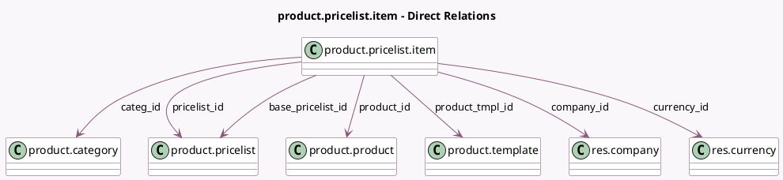

<!-- GENERATED:MODEL -->
---
tags: [odoo, community, generated, model]
---

# product.pricelist.item

- Module: [[docs/Community Addons/product/product|product]]
- Scope: Community Addons
- Defined in module: yes
- Source files: `models/product_pricelist_item.py`
- Python classes: `ProductPricelistItem`
- Description: Pricelist Rule

## Field footprint

- Detected fields: 28
- Field types: `Boolean` x 1, `Char` x 4, `Datetime` x 2, `Float` x 9, `Integer` x 1, `Many2one` x 7, `Selection` x 4
- Relation fields: 7

## Sample fields

- `applied_on`: `Selection`
- `base`: `Selection`
- `base_pricelist_id`: `Many2one` (comodel `product.pricelist`)
- `categ_id`: `Many2one` (comodel `product.category`)
- `company_id`: `Many2one` (comodel `res.company`, compute `_compute_company_id`, store `True`)
- `compute_price`: `Selection`
- `currency_id`: `Many2one` (comodel `res.currency`, compute `_compute_currency_id`, store `True`)
- `date_end`: `Datetime`
- `date_start`: `Datetime`
- `display_applied_on`: `Selection`
- `fixed_price`: `Float`
- `is_pricelist_required`: `Boolean` (compute `_compute_is_pricelist_required`)
- `min_quantity`: `Float`
- `name`: `Char` (compute `_compute_name`)
- `percent_price`: `Float`
- `price`: `Char` (compute `_compute_price_label`)
- `price_discount`: `Float`
- `price_markup`: `Float` (compute `_compute_price_markup`, store `True`)
- `price_max_margin`: `Float`
- `price_min_margin`: `Float`

## Method hints

- Detected methods: 30
- Action methods: none
- Compute methods: `_compute_base_price`, `_compute_company_id`, `_compute_currency_id`, `_compute_is_pricelist_required`, `_compute_name`, `_compute_price`, `_compute_price_before_discount`, `_compute_price_label`, and 2 more
- Onchange methods: `_onchange_base`, `_onchange_base_pricelist_id`, `_onchange_compute_price`, `_onchange_display_applied_on`, `_onchange_price_round`, `_onchange_product_id`, `_onchange_product_tmpl_id`, `_onchange_rule_content`, and 1 more

## Direct relation diagram

## Navigation

- **Parent:** [[docs/Community Addons/product/Models]]

<!-- GENERATED:MODEL -->
