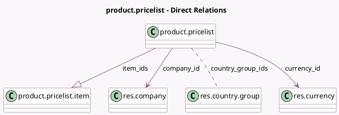

<!-- GENERATED:MODEL -->
---
tags: [odoo, community, generated, model]
---

# product.pricelist

- Module: [[docs/Community Addons/product/product|product]]
- Scope: Community Addons
- Defined in module: yes
- Source files: `models/product_pricelist.py`
- Python classes: `ProductPricelist`
- Description: Pricelist
- Inherits: `mail.activity.mixin`, `mail.thread`

## Field footprint

- Detected fields: 7
- Field types: `Boolean` x 1, `Char` x 1, `Integer` x 1, `Many2many` x 1, `Many2one` x 2, `One2many` x 1
- Relation fields: 4

## Sample fields

- `active`: `Boolean`
- `company_id`: `Many2one` (comodel `res.company`)
- `country_group_ids`: `Many2many` (comodel `res.country.group`)
- `currency_id`: `Many2one` (comodel `res.currency`)
- `item_ids`: `One2many` (comodel `product.pricelist.item`)
- `name`: `Char`
- `sequence`: `Integer`

## Method hints

- Detected methods: 21
- Action methods: `action_open_pricelist_report`
- Compute methods: `_compute_display_name`, `_compute_price_rule`, `_compute_price_rule_multi`
- Onchange methods: none

## Direct relation diagram

## Navigation

- **Parent:** [[docs/Community Addons/product/Models]]

<!-- GENERATED:MODEL -->
