<!-- GENERATED:MODEL -->
---
tags: [odoo, community, generated, model]
---

# product.product

- Module: [[docs/Community Addons/product/product|product]]
- Scope: Community Addons
- Defined in module: yes
- Source files: `models/product_product.py`
- Python classes: `ProductProduct`
- Description: Product Variant
- Inherits: `mail.activity.mixin`, `mail.thread`

## Field footprint

- Detected fields: 36
- Field types: `Boolean` x 6, `Char` x 5, `Datetime` x 1, `Float` x 5, `Image` x 10, `Integer` x 1, `Many2many` x 4, `Many2one` x 1, `One2many` x 3
- Relation fields: 8

## Sample fields

- `active`: `Boolean` (comodel `Active`)
- `additional_product_tag_ids`: `Many2many` (comodel `product.tag`)
- `all_product_tag_ids`: `Many2many` (comodel `product.tag`, compute `_compute_all_product_tag_ids`)
- `barcode`: `Char` (comodel `Barcode`)
- `can_image_1024_be_zoomed`: `Boolean` (comodel `Can Image 1024 be zoomed`, compute `_compute_can_image_1024_be_zoomed`)
- `can_image_variant_1024_be_zoomed`: `Boolean` (comodel `Can Variant Image 1024 be zoomed`, compute `_compute_can_image_variant_1024_be_zoomed`, store `True`)
- `code`: `Char` (comodel `Reference`, compute `_compute_product_code`)
- `combination_indices`: `Char` (compute `_compute_combination_indices`, store `True`)
- `default_code`: `Char` (comodel `Internal Reference`)
- `image_1024`: `Image` (comodel `Image 1024`, compute `_compute_image_1024`)
- `image_128`: `Image` (comodel `Image 128`, compute `_compute_image_128`)
- `image_1920`: `Image` (comodel `Image`, compute `_compute_image_1920`)
- `image_256`: `Image` (comodel `Image 256`, compute `_compute_image_256`)
- `image_512`: `Image` (comodel `Image 512`, compute `_compute_image_512`)
- `image_variant_1024`: `Image` (comodel `Variant Image 1024`, related `image_variant_1920`, store `True`)
- `image_variant_128`: `Image` (comodel `Variant Image 128`, related `image_variant_1920`, store `True`)
- `image_variant_1920`: `Image` (comodel `Variant Image`)
- `image_variant_256`: `Image` (comodel `Variant Image 256`, related `image_variant_1920`, store `True`)
- `image_variant_512`: `Image` (comodel `Variant Image 512`, related `image_variant_1920`, store `True`)
- `is_favorite`: `Boolean` (related `product_tmpl_id.is_favorite`, store `True`)

## Method hints

- Detected methods: 65
- Action methods: `action_archive`, `action_open_documents`, `action_open_label_layout`, `action_unarchive`
- Compute methods: `_compute_all_product_tag_ids`, `_compute_can_image_1024_be_zoomed`, `_compute_can_image_variant_1024_be_zoomed`, `_compute_combination_indices`, `_compute_display_name`, `_compute_image_1024`, `_compute_image_128`, `_compute_image_1920`, and 10 more
- Onchange methods: `_onchange_default_code`, `_onchange_standard_price`, `_onchange_uom_id`, `_set_product_lst_price`

## Direct relation diagram

```plantuml
@startuml
!define ODOO_COLOR_PRIMARY #714B67
!define ODOO_COLOR_ACCENT #875A7B
!define ODOO_COLOR_BG #FAF7FA

skinparam backgroundColor ODOO_COLOR_BG
skinparam defaultTextAlignment left
skinparam ArrowColor ODOO_COLOR_ACCENT
skinparam ClassBackgroundColor white
skinparam ClassBorderColor ODOO_COLOR_PRIMARY
skinparam ComponentBackgroundColor white
skinparam ComponentBorderColor ODOO_COLOR_PRIMARY
skinparam NoteBackgroundColor #FFF8FF
skinparam NoteBorderColor ODOO_COLOR_ACCENT
skinparam SequenceLifeLineBorderColor ODOO_COLOR_ACCENT
skinparam SequenceLifeLineBackgroundColor #FFFFFF
skinparam SequenceParticipantBorderColor ODOO_COLOR_PRIMARY
skinparam SequenceParticipantBackgroundColor #FFFFFF
skinparam sequence {
  ArrowColor ODOO_COLOR_ACCENT
  ActorBorderColor ODOO_COLOR_PRIMARY
}
title product.product - Direct Relations
class "product.product" as product_product
class "product.document" as product_document
class "product.pricelist.item" as product_pricelist_item
class "product.tag" as product_tag
class "product.template" as product_template
class "product.template.attribute.value" as product_template_attribute_value
class "product.uom" as product_uom
product_product --> product_template : product_tmpl_id
product_product --|> product_uom : product_uom_ids
product_product .. product_template_attribute_value : product_template_attribute_value_ids
product_product .. product_template_attribute_value : product_template_variant_value_ids
product_product --|> product_pricelist_item : pricelist_rule_ids
product_product --|> product_document : product_document_ids
product_product .. product_tag : additional_product_tag_ids
product_product .. product_tag : all_product_tag_ids
@enduml
```

## Navigation

- **Parent:** [[docs/Community Addons/product/Models]]

<!-- GENERATED:MODEL -->
