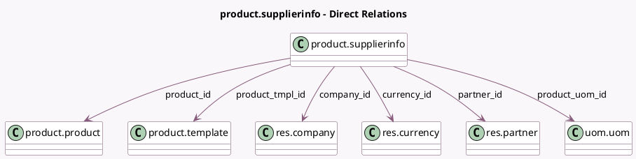

<!-- GENERATED:MODEL -->
---
tags: [odoo, community, generated, model]
---

# product.supplierinfo

- Module: [[docs/Community Addons/product/product|product]]
- Scope: Community Addons
- Defined in module: yes
- Source files: `models/product_supplierinfo.py`
- Python classes: `ProductSupplierinfo`
- Description: Supplier Pricelist

## Field footprint

- Detected fields: 17
- Field types: `Char` x 2, `Date` x 2, `Float` x 4, `Integer` x 3, `Many2one` x 6
- Relation fields: 6

## Sample fields

- `company_id`: `Many2one` (comodel `res.company`)
- `currency_id`: `Many2one` (comodel `res.currency`)
- `date_end`: `Date` (comodel `End Date`)
- `date_start`: `Date` (comodel `Start Date`)
- `delay`: `Integer` (comodel `Lead Time`)
- `discount`: `Float`
- `min_qty`: `Float` (comodel `Quantity`)
- `partner_id`: `Many2one` (comodel `res.partner`)
- `price`: `Float` (comodel `Unit Price`)
- `price_discounted`: `Float` (comodel `Discounted Price`, compute `_compute_price_discounted`)
- `product_code`: `Char` (comodel `Vendor Product Code`)
- `product_id`: `Many2one` (comodel `product.product`, compute `_compute_product_id`, store `True`)
- `product_name`: `Char` (comodel `Vendor Product Name`)
- `product_tmpl_id`: `Many2one` (comodel `product.template`, compute `_compute_product_tmpl_id`, store `True`)
- `product_uom_id`: `Many2one` (comodel `uom.uom`, compute `_compute_product_uom_id`, store `True`)
- `product_variant_count`: `Integer` (comodel `Variant Count`, related `product_tmpl_id.product_variant_count`)
- `sequence`: `Integer` (comodel `Sequence`)

## Method hints

- Detected methods: 11
- Action methods: none
- Compute methods: `_compute_price`, `_compute_price_discounted`, `_compute_product_id`, `_compute_product_tmpl_id`, `_compute_product_uom_id`
- Onchange methods: `_onchange_product_tmpl_id`

## Direct relation diagram

## Navigation

- **Parent:** [[docs/Community Addons/product/Models]]

<!-- GENERATED:MODEL -->
