<!-- GENERATED:MODEL -->
---
tags: [odoo, community, generated, model]
---

# product.tag

- Module: [[docs/Community Addons/product/product|product]]
- Scope: Community Addons
- Defined in module: yes
- Source files: `models/product_tag.py`
- Python classes: `ProductTag`
- Description: Product Tag

## Field footprint

- Detected fields: 8
- Field types: `Boolean` x 1, `Char` x 2, `Image` x 1, `Integer` x 1, `Many2many` x 3
- Relation fields: 3

## Sample fields

- `color`: `Char`
- `image`: `Image`
- `name`: `Char`
- `product_ids`: `Many2many` (comodel `product.product`, compute `_compute_product_ids`)
- `product_product_ids`: `Many2many` (comodel `product.product`)
- `product_template_ids`: `Many2many` (comodel `product.template`)
- `sequence`: `Integer`
- `visible_to_customers`: `Boolean`

## Method hints

- Detected methods: 5
- Action methods: none
- Compute methods: `_compute_product_ids`
- Onchange methods: none

## Direct relation diagram

```plantuml
@startuml
!define ODOO_COLOR_PRIMARY #714B67
!define ODOO_COLOR_ACCENT #875A7B
!define ODOO_COLOR_BG #FAF7FA

skinparam backgroundColor ODOO_COLOR_BG
skinparam defaultTextAlignment left
skinparam ArrowColor ODOO_COLOR_ACCENT
skinparam ClassBackgroundColor white
skinparam ClassBorderColor ODOO_COLOR_PRIMARY
skinparam ComponentBackgroundColor white
skinparam ComponentBorderColor ODOO_COLOR_PRIMARY
skinparam NoteBackgroundColor #FFF8FF
skinparam NoteBorderColor ODOO_COLOR_ACCENT
skinparam SequenceLifeLineBorderColor ODOO_COLOR_ACCENT
skinparam SequenceLifeLineBackgroundColor #FFFFFF
skinparam SequenceParticipantBorderColor ODOO_COLOR_PRIMARY
skinparam SequenceParticipantBackgroundColor #FFFFFF
skinparam sequence {
  ArrowColor ODOO_COLOR_ACCENT
  ActorBorderColor ODOO_COLOR_PRIMARY
}
title product.tag - Direct Relations
class "product.tag" as product_tag
class "product.product" as product_product
class "product.template" as product_template
product_tag .. product_template : product_template_ids
product_tag .. product_product : product_product_ids
product_tag .. product_product : product_ids
@enduml
```

## Navigation

- **Parent:** [[docs/Community Addons/product/Models]]

<!-- GENERATED:MODEL -->
