<!-- GENERATED:MODEL -->
---
tags: [odoo, community, generated, model]
---

# product.template.attribute.exclusion

- Module: [[docs/Community Addons/product/product|product]]
- Scope: Community Addons
- Defined in module: yes
- Source files: `models/product_template_attribute_exclusion.py`
- Python classes: `ProductTemplateAttributeExclusion`
- Description: Product Template Attribute Exclusion

## Field footprint

- Detected fields: 3
- Field types: `Many2many` x 1, `Many2one` x 2
- Relation fields: 3

## Sample fields

- `product_template_attribute_value_id`: `Many2one` (comodel `product.template.attribute.value`)
- `product_tmpl_id`: `Many2one` (comodel `product.template`)
- `value_ids`: `Many2many` (comodel `product.template.attribute.value`)

## Method hints

- Detected methods: 3
- Action methods: none
- Compute methods: none
- Onchange methods: none

## Direct relation diagram

```plantuml
@startuml
!define ODOO_COLOR_PRIMARY #714B67
!define ODOO_COLOR_ACCENT #875A7B
!define ODOO_COLOR_BG #FAF7FA

skinparam backgroundColor ODOO_COLOR_BG
skinparam defaultTextAlignment left
skinparam ArrowColor ODOO_COLOR_ACCENT
skinparam ClassBackgroundColor white
skinparam ClassBorderColor ODOO_COLOR_PRIMARY
skinparam ComponentBackgroundColor white
skinparam ComponentBorderColor ODOO_COLOR_PRIMARY
skinparam NoteBackgroundColor #FFF8FF
skinparam NoteBorderColor ODOO_COLOR_ACCENT
skinparam SequenceLifeLineBorderColor ODOO_COLOR_ACCENT
skinparam SequenceLifeLineBackgroundColor #FFFFFF
skinparam SequenceParticipantBorderColor ODOO_COLOR_PRIMARY
skinparam SequenceParticipantBackgroundColor #FFFFFF
skinparam sequence {
  ArrowColor ODOO_COLOR_ACCENT
  ActorBorderColor ODOO_COLOR_PRIMARY
}
title product.template.attribute.exclusion - Direct Relations
class "product.template.attribute.exclusion" as product_template_attribute_exclusion
class "product.template" as product_template
class "product.template.attribute.value" as product_template_attribute_value
product_template_attribute_exclusion --> product_template_attribute_value : product_template_attribute_value_id
product_template_attribute_exclusion --> product_template : product_tmpl_id
product_template_attribute_exclusion .. product_template_attribute_value : value_ids
@enduml
```

## Navigation

- **Parent:** [[docs/Community Addons/product/Models]]

<!-- GENERATED:MODEL -->
