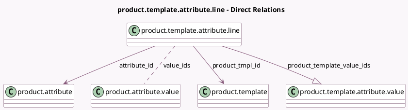

<!-- GENERATED:MODEL -->
---
tags: [odoo, community, generated, model]
---

# product.template.attribute.line

- Module: [[docs/Community Addons/product/product|product]]
- Scope: Community Addons
- Defined in module: yes
- Source files: `models/product_template_attribute_line.py`
- Python classes: `ProductTemplateAttributeLine`
- Description: Product Template Attribute Line

## Field footprint

- Detected fields: 7
- Field types: `Boolean` x 1, `Integer` x 2, `Many2many` x 1, `Many2one` x 2, `One2many` x 1
- Relation fields: 4

## Sample fields

- `active`: `Boolean`
- `attribute_id`: `Many2one` (comodel `product.attribute`)
- `product_template_value_ids`: `One2many` (comodel `product.template.attribute.value`)
- `product_tmpl_id`: `Many2one` (comodel `product.template`)
- `sequence`: `Integer` (comodel `Sequence`)
- `value_count`: `Integer` (compute `_compute_value_count`, store `True`)
- `value_ids`: `Many2many` (comodel `product.attribute.value`)

## Method hints

- Detected methods: 10
- Action methods: `action_open_attribute_values`
- Compute methods: `_compute_value_count`
- Onchange methods: `_onchange_attribute_id`

## Direct relation diagram

## Navigation

- **Parent:** [[docs/Community Addons/product/Models]]

<!-- GENERATED:MODEL -->
