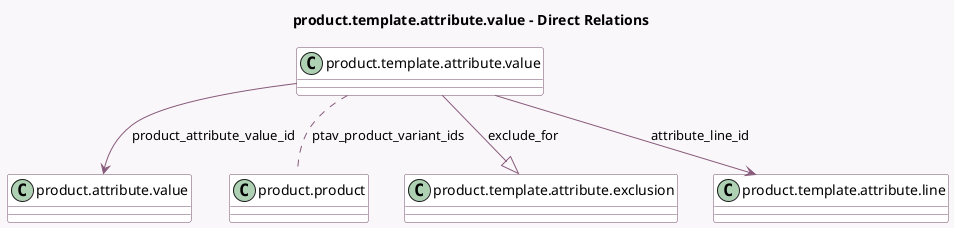

<!-- GENERATED:MODEL -->
---
tags: [odoo, community, generated, model]
---

# product.template.attribute.value

- Module: [[docs/Community Addons/product/product|product]]
- Scope: Community Addons
- Defined in module: yes
- Source files: `models/product_template_attribute_value.py`
- Python classes: `ProductTemplateAttributeValue`
- Description: Product Template Attribute Value

## Field footprint

- Detected fields: 15
- Field types: `Boolean` x 2, `Char` x 2, `Float` x 1, `Image` x 1, `Integer` x 1, `Many2many` x 1, `Many2one` x 5, `One2many` x 1, `Selection` x 1
- Relation fields: 7

## Sample fields

- `attribute_id`: `Many2one` (related `attribute_line_id.attribute_id`, store `True`)
- `attribute_line_id`: `Many2one` (comodel `product.template.attribute.line`)
- `color`: `Integer`
- `currency_id`: `Many2one` (related `attribute_line_id.product_tmpl_id.currency_id`)
- `display_type`: `Selection` (related `product_attribute_value_id.display_type`)
- `exclude_for`: `One2many` (comodel `product.template.attribute.exclusion`)
- `html_color`: `Char` (related `product_attribute_value_id.html_color`)
- `image`: `Image` (related `product_attribute_value_id.image`)
- `is_custom`: `Boolean` (related `product_attribute_value_id.is_custom`)
- `name`: `Char` (related `product_attribute_value_id.name`)
- `price_extra`: `Float`
- `product_attribute_value_id`: `Many2one` (comodel `product.attribute.value`)
- `product_tmpl_id`: `Many2one` (related `attribute_line_id.product_tmpl_id`, store `True`)
- `ptav_active`: `Boolean`
- `ptav_product_variant_ids`: `Many2many` (comodel `product.product`)

## Method hints

- Detected methods: 12
- Action methods: none
- Compute methods: `_compute_display_name`
- Onchange methods: none

## Direct relation diagram

## Navigation

- **Parent:** [[docs/Community Addons/product/Models]]

<!-- GENERATED:MODEL -->
