<!-- GENERATED:MODEL -->
---
tags: [odoo, community, generated, model]
---

# product.template

- Module: [[docs/Community Addons/product/product|product]]
- Scope: Community Addons
- Defined in module: yes
- Source files: `models/product_template.py`
- Python classes: `ProductTemplate`
- Description: Product
- Inherits: `image.mixin`, `mail.activity.mixin`, `mail.thread`

## Field footprint

- Detected fields: 45
- Field types: `Boolean` x 8, `Char` x 7, `Float` x 4, `Html` x 1, `Integer` x 4, `Many2many` x 4, `Many2one` x 6, `One2many` x 6, `Properties` x 1, `Selection` x 2, `Text` x 2
- Relation fields: 16

## Sample fields

- `active`: `Boolean` (comodel `Active`)
- `attribute_line_ids`: `One2many` (comodel `product.template.attribute.line`)
- `barcode`: `Char` (comodel `Barcode`, compute `_compute_barcode`)
- `can_image_1024_be_zoomed`: `Boolean` (comodel `Can Image 1024 be zoomed`, compute `_compute_can_image_1024_be_zoomed`, store `True`)
- `categ_id`: `Many2one` (comodel `product.category`)
- `color`: `Integer` (comodel `Color Index`)
- `combo_ids`: `Many2many` (comodel `product.combo`)
- `company_id`: `Many2one` (comodel `res.company`)
- `cost_currency_id`: `Many2one` (comodel `res.currency`, compute `_compute_cost_currency_id`)
- `currency_id`: `Many2one` (comodel `res.currency`, compute `_compute_currency_id`)
- `default_code`: `Char` (comodel `Internal Reference`, compute `_compute_default_code`, store `True`)
- `description`: `Html` (comodel `Description`)
- `description_purchase`: `Text` (comodel `Purchase Description`)
- `description_sale`: `Text` (comodel `Sales Description`)
- `has_configurable_attributes`: `Boolean` (comodel `Is a configurable product`, compute `_compute_has_configurable_attributes`, store `True`)
- `is_dynamically_created`: `Boolean` (comodel `Is Dynamically Created`, compute `_compute_is_dynamically_created`)
- `is_favorite`: `Boolean`
- `is_product_variant`: `Boolean` (compute `_compute_is_product_variant`)
- `list_price`: `Float` (comodel `Sales Price`)
- `name`: `Char` (comodel `Name`)

## Method hints

- Detected methods: 97
- Action methods: `action_open_documents`, `action_open_label_layout`
- Compute methods: `_compute_barcode`, `_compute_can_image_1024_be_zoomed`, `_compute_cost_currency_id`, `_compute_currency_id`, `_compute_default_code`, `_compute_display_name`, `_compute_has_configurable_attributes`, `_compute_is_dynamically_created`, and 14 more
- Onchange methods: `_onchange_default_code`, `_onchange_standard_price`, `_onchange_type`, `_onchange_uom_id`

## Direct relation diagram

```plantuml
@startuml
!define ODOO_COLOR_PRIMARY #714B67
!define ODOO_COLOR_ACCENT #875A7B
!define ODOO_COLOR_BG #FAF7FA

skinparam backgroundColor ODOO_COLOR_BG
skinparam defaultTextAlignment left
skinparam ArrowColor ODOO_COLOR_ACCENT
skinparam ClassBackgroundColor white
skinparam ClassBorderColor ODOO_COLOR_PRIMARY
skinparam ComponentBackgroundColor white
skinparam ComponentBorderColor ODOO_COLOR_PRIMARY
skinparam NoteBackgroundColor #FFF8FF
skinparam NoteBorderColor ODOO_COLOR_ACCENT
skinparam SequenceLifeLineBorderColor ODOO_COLOR_ACCENT
skinparam SequenceLifeLineBackgroundColor #FFFFFF
skinparam SequenceParticipantBorderColor ODOO_COLOR_PRIMARY
skinparam SequenceParticipantBackgroundColor #FFFFFF
skinparam sequence {
  ArrowColor ODOO_COLOR_ACCENT
  ActorBorderColor ODOO_COLOR_PRIMARY
}
title product.template - Direct Relations
class "product.template" as product_template
class "product.category" as product_category
class "product.combo" as product_combo
class "product.document" as product_document
class "product.pricelist.item" as product_pricelist_item
class "product.product" as product_product
class "product.supplierinfo" as product_supplierinfo
class "product.tag" as product_tag
class "product.template.attribute.line" as product_template_attribute_line
class "res.company" as res_company
class "res.currency" as res_currency
class "uom.uom" as uom_uom
product_template .. product_combo : combo_ids
product_template --> product_category : categ_id
product_template --> res_currency : currency_id
product_template --> res_currency : cost_currency_id
product_template --> uom_uom : uom_id
product_template .. uom_uom : uom_ids
product_template --> res_company : company_id
product_template --|> product_supplierinfo : seller_ids
product_template --|> product_supplierinfo : variant_seller_ids
product_template --|> product_template_attribute_line : attribute_line_ids
product_template .. product_template_attribute_line : valid_product_template_attribute_line_ids
product_template --|> product_product : product_variant_ids
product_template --> product_product : product_variant_id
product_template --|> product_pricelist_item : pricelist_rule_ids
product_template --|> product_document : product_document_ids
product_template .. product_tag : product_tag_ids
@enduml
```

## Navigation

- **Parent:** [[docs/Community Addons/product/Models]]

<!-- GENERATED:MODEL -->
