<!-- GENERATED:MODEL -->
---
tags: [odoo, community, generated, model]
---

# product.uom

- Module: [[docs/Community Addons/product/product|product]]
- Scope: Community Addons
- Defined in module: yes
- Source files: `models/product_uom.py`
- Python classes: `ProductUom`
- Description: Link between products and their UoMs

## Field footprint

- Detected fields: 4
- Field types: `Char` x 1, `Many2one` x 3
- Relation fields: 3

## Sample fields

- `barcode`: `Char`
- `company_id`: `Many2one` (comodel `res.company`)
- `product_id`: `Many2one` (comodel `product.product`)
- `uom_id`: `Many2one` (comodel `uom.uom`)

## Method hints

- Detected methods: 2
- Action methods: none
- Compute methods: `_compute_display_name`
- Onchange methods: none

## Direct relation diagram

```plantuml
@startuml
!define ODOO_COLOR_PRIMARY #714B67
!define ODOO_COLOR_ACCENT #875A7B
!define ODOO_COLOR_BG #FAF7FA

skinparam backgroundColor ODOO_COLOR_BG
skinparam defaultTextAlignment left
skinparam ArrowColor ODOO_COLOR_ACCENT
skinparam ClassBackgroundColor white
skinparam ClassBorderColor ODOO_COLOR_PRIMARY
skinparam ComponentBackgroundColor white
skinparam ComponentBorderColor ODOO_COLOR_PRIMARY
skinparam NoteBackgroundColor #FFF8FF
skinparam NoteBorderColor ODOO_COLOR_ACCENT
skinparam SequenceLifeLineBorderColor ODOO_COLOR_ACCENT
skinparam SequenceLifeLineBackgroundColor #FFFFFF
skinparam SequenceParticipantBorderColor ODOO_COLOR_PRIMARY
skinparam SequenceParticipantBackgroundColor #FFFFFF
skinparam sequence {
  ArrowColor ODOO_COLOR_ACCENT
  ActorBorderColor ODOO_COLOR_PRIMARY
}
title product.uom - Direct Relations
class "product.uom" as product_uom
class "product.product" as product_product
class "res.company" as res_company
class "uom.uom" as uom_uom
product_uom --> uom_uom : uom_id
product_uom --> product_product : product_id
product_uom --> res_company : company_id
@enduml
```

## Navigation

- **Parent:** [[docs/Community Addons/product/Models]]

<!-- GENERATED:MODEL -->
