<!-- GENERATED:MODEL -->
---
tags: [odoo, community, generated, model]
---

# update.product.attribute.value

- Module: [[docs/Community Addons/product/product|product]]
- Scope: Community Addons
- Defined in module: yes
- Source files: `wizard/update_product_attribute_value.py`
- Python classes: `UpdateProductAttributeValue`
- Description: Update product attribute value

## Field footprint

- Detected fields: 4
- Field types: `Char` x 1, `Integer` x 1, `Many2one` x 1, `Selection` x 1
- Relation fields: 1

## Sample fields

- `attribute_value_id`: `Many2one` (comodel `product.attribute.value`)
- `message`: `Char` (compute `_compute_message`)
- `mode`: `Selection`
- `product_count`: `Integer` (compute `_compute_product_count`)

## Method hints

- Detected methods: 5
- Action methods: `action_confirm`
- Compute methods: `_compute_message`, `_compute_product_count`
- Onchange methods: none

## Direct relation diagram

```plantuml
@startuml
!define ODOO_COLOR_PRIMARY #714B67
!define ODOO_COLOR_ACCENT #875A7B
!define ODOO_COLOR_BG #FAF7FA

skinparam backgroundColor ODOO_COLOR_BG
skinparam defaultTextAlignment left
skinparam ArrowColor ODOO_COLOR_ACCENT
skinparam ClassBackgroundColor white
skinparam ClassBorderColor ODOO_COLOR_PRIMARY
skinparam ComponentBackgroundColor white
skinparam ComponentBorderColor ODOO_COLOR_PRIMARY
skinparam NoteBackgroundColor #FFF8FF
skinparam NoteBorderColor ODOO_COLOR_ACCENT
skinparam SequenceLifeLineBorderColor ODOO_COLOR_ACCENT
skinparam SequenceLifeLineBackgroundColor #FFFFFF
skinparam SequenceParticipantBorderColor ODOO_COLOR_PRIMARY
skinparam SequenceParticipantBackgroundColor #FFFFFF
skinparam sequence {
  ArrowColor ODOO_COLOR_ACCENT
  ActorBorderColor ODOO_COLOR_PRIMARY
}
title update.product.attribute.value - Direct Relations
class "update.product.attribute.value" as update_product_attribute_value
class "product.attribute.value" as product_attribute_value
update_product_attribute_value --> product_attribute_value : attribute_value_id
@enduml
```

## Navigation

- **Parent:** [[docs/Community Addons/product/Models]]

<!-- GENERATED:MODEL -->
