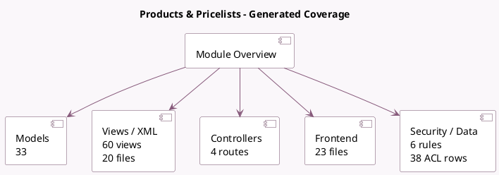

<!-- GENERATED:MODULE -->
---
tags: [odoo, community, module]
---

# Products & Pricelists

- Scope: Community Addons
- Source: odoo/addons/product
- Dependencies: base (not documented), [[docs/Community Addons/mail/mail|mail]], [[docs/Community Addons/uom/uom|uom]]

## Generated coverage

- Models: 33
- XML files with UI/data artifacts: 20
- Views: 60
- Actions: 24
- Menus: 0
- Rules (ir.rule): 6
- Access CSV entries: 38
- Controller units: 3
- Frontend asset files: 23

## Module map

## Detail notes

- Models: [[docs/Community Addons/product/Models|Models]] (33)
- Views and XML: [[docs/Community Addons/product/Views|Views]] (20 files)
- Controllers: [[docs/Community Addons/product/Controllers|Controllers]] (3)
- Frontend: [[docs/Community Addons/product/Frontend|Frontend]] (23 files)

## Key models

- `ir.attachment`
- `product.attribute`
- `product.attribute.custom.value`
- `product.attribute.value`
- `product.catalog.mixin`
- `product.category`
- `product.combo`
- `product.combo.item`
- `product.document`
- `product.label.layout`
- `product.pricelist`
- `product.pricelist.item`

## Navigation

- [[../Community Addons/Community Addons|Back to scope]]
- [[../../docs/docs|Back to docs]]

<!-- GENERATED:MODULE -->

