<!-- GENERATED:MODEL -->
---
tags: [odoo, community, generated, model]
---

# expiry.picking.confirmation

- Module: [[docs/Community Addons/product_expiry/product_expiry|product_expiry]]
- Scope: Community Addons
- Defined in module: yes
- Source files: `wizard/confirm_expiry.py`
- Python classes: `ExpiryPickingConfirmation`
- Description: Confirm Expiry

## Field footprint

- Detected fields: 4
- Field types: `Boolean` x 1, `Char` x 1, `Many2many` x 2
- Relation fields: 2

## Sample fields

- `description`: `Char` (comodel `Description`, compute `_compute_descriptive_fields`)
- `lot_ids`: `Many2many` (comodel `stock.lot`)
- `picking_ids`: `Many2many` (comodel `stock.picking`)
- `show_lots`: `Boolean` (comodel `Show Lots`, compute `_compute_descriptive_fields`)

## Method hints

- Detected methods: 3
- Action methods: none
- Compute methods: `_compute_descriptive_fields`
- Onchange methods: none

## Direct relation diagram

```plantuml
@startuml
!define ODOO_COLOR_PRIMARY #714B67
!define ODOO_COLOR_ACCENT #875A7B
!define ODOO_COLOR_BG #FAF7FA

skinparam backgroundColor ODOO_COLOR_BG
skinparam defaultTextAlignment left
skinparam ArrowColor ODOO_COLOR_ACCENT
skinparam ClassBackgroundColor white
skinparam ClassBorderColor ODOO_COLOR_PRIMARY
skinparam ComponentBackgroundColor white
skinparam ComponentBorderColor ODOO_COLOR_PRIMARY
skinparam NoteBackgroundColor #FFF8FF
skinparam NoteBorderColor ODOO_COLOR_ACCENT
skinparam SequenceLifeLineBorderColor ODOO_COLOR_ACCENT
skinparam SequenceLifeLineBackgroundColor #FFFFFF
skinparam SequenceParticipantBorderColor ODOO_COLOR_PRIMARY
skinparam SequenceParticipantBackgroundColor #FFFFFF
skinparam sequence {
  ArrowColor ODOO_COLOR_ACCENT
  ActorBorderColor ODOO_COLOR_PRIMARY
}
title expiry.picking.confirmation - Direct Relations
class "expiry.picking.confirmation" as expiry_picking_confirmation
class "stock.lot" as stock_lot
class "stock.picking" as stock_picking
expiry_picking_confirmation .. stock_lot : lot_ids
expiry_picking_confirmation .. stock_picking : picking_ids
@enduml
```

## Navigation

- **Parent:** [[docs/Community Addons/product_expiry/Models]]

<!-- GENERATED:MODEL -->
