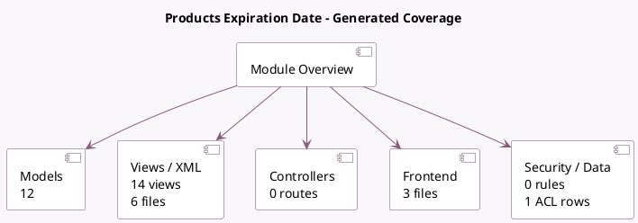

<!-- GENERATED:MODULE -->
---
tags: [odoo, community, module]
---

# Products Expiration Date

- Scope: Community Addons
- Source: odoo/addons/product_expiry
- Dependencies: [[docs/Community Addons/stock/stock|stock]]

## Generated coverage

- Models: 12
- XML files with UI/data artifacts: 6
- Views: 14
- Actions: 0
- Menus: 0
- Rules (ir.rule): 0
- Access CSV entries: 1
- Controller units: 0
- Frontend asset files: 3

## Module map

## Detail notes

- Models: [[docs/Community Addons/product_expiry/Models|Models]] (12)
- Views and XML: [[docs/Community Addons/product_expiry/Views|Views]] (6 files)
- Frontend: [[docs/Community Addons/product_expiry/Frontend|Frontend]] (3 files)

## Key models

- `expiry.picking.confirmation`
- `product.product`
- `product.template`
- `report.stock.quantity`
- `res.config.settings`
- `stock.forecasted_product_product`
- `stock.lot`
- `stock.move`
- `stock.move.line`
- `stock.picking`
- `stock.quant`
- `stock.rule`

## Navigation

- [[../Community Addons/Community Addons|Back to scope]]
- [[../../docs/docs|Back to docs]]

<!-- GENERATED:MODULE -->

