<!-- GENERATED:MODEL -->
---
tags: [odoo, community, generated, model]
---

# account.analytic.account

- Module: [[docs/Community Addons/project/project|project]]
- Scope: Community Addons
- Defined in module: extension only
- Source files: `models/account_analytic_account.py`
- Python classes: `AccountAnalyticAccount`
- Description: Analytic Account

## Field footprint

- Detected fields: 2
- Field types: `Integer` x 1, `One2many` x 1
- Relation fields: 1

## Sample fields

- `project_count`: `Integer` (comodel `Project Count`, compute `_compute_project_count`)
- `project_ids`: `One2many` (comodel `project.project`)

## Method hints

- Detected methods: 3
- Action methods: `action_view_projects`
- Compute methods: `_compute_project_count`
- Onchange methods: none

## Direct relation diagram

```plantuml
@startuml
!define ODOO_COLOR_PRIMARY #714B67
!define ODOO_COLOR_ACCENT #875A7B
!define ODOO_COLOR_BG #FAF7FA

skinparam backgroundColor ODOO_COLOR_BG
skinparam defaultTextAlignment left
skinparam ArrowColor ODOO_COLOR_ACCENT
skinparam ClassBackgroundColor white
skinparam ClassBorderColor ODOO_COLOR_PRIMARY
skinparam ComponentBackgroundColor white
skinparam ComponentBorderColor ODOO_COLOR_PRIMARY
skinparam NoteBackgroundColor #FFF8FF
skinparam NoteBorderColor ODOO_COLOR_ACCENT
skinparam SequenceLifeLineBorderColor ODOO_COLOR_ACCENT
skinparam SequenceLifeLineBackgroundColor #FFFFFF
skinparam SequenceParticipantBorderColor ODOO_COLOR_PRIMARY
skinparam SequenceParticipantBackgroundColor #FFFFFF
skinparam sequence {
  ArrowColor ODOO_COLOR_ACCENT
  ActorBorderColor ODOO_COLOR_PRIMARY
}
title account.analytic.account - Direct Relations
class "account.analytic.account" as account_analytic_account
class "project.project" as project_project
account_analytic_account --|> project_project : project_ids
@enduml
```

## Navigation

- **Parent:** [[docs/Community Addons/project/Models]]

<!-- GENERATED:MODEL -->
