<!-- GENERATED:MODEL -->
---
tags: [odoo, community, generated, model]
---

# project.collaborator

- Module: [[docs/Community Addons/project/project|project]]
- Scope: Community Addons
- Defined in module: yes
- Source files: `models/project_collaborator.py`
- Python classes: `ProjectCollaborator`
- Description: Collaborators in project shared

## Field footprint

- Detected fields: 4
- Field types: `Boolean` x 1, `Char` x 1, `Many2one` x 2
- Relation fields: 2

## Sample fields

- `limited_access`: `Boolean` (comodel `Limited Access`)
- `partner_email`: `Char` (related `partner_id.email`)
- `partner_id`: `Many2one` (comodel `res.partner`)
- `project_id`: `Many2one` (comodel `project.project`)

## Method hints

- Detected methods: 4
- Action methods: none
- Compute methods: `_compute_display_name`
- Onchange methods: none

## Direct relation diagram

```plantuml
@startuml
!define ODOO_COLOR_PRIMARY #714B67
!define ODOO_COLOR_ACCENT #875A7B
!define ODOO_COLOR_BG #FAF7FA

skinparam backgroundColor ODOO_COLOR_BG
skinparam defaultTextAlignment left
skinparam ArrowColor ODOO_COLOR_ACCENT
skinparam ClassBackgroundColor white
skinparam ClassBorderColor ODOO_COLOR_PRIMARY
skinparam ComponentBackgroundColor white
skinparam ComponentBorderColor ODOO_COLOR_PRIMARY
skinparam NoteBackgroundColor #FFF8FF
skinparam NoteBorderColor ODOO_COLOR_ACCENT
skinparam SequenceLifeLineBorderColor ODOO_COLOR_ACCENT
skinparam SequenceLifeLineBackgroundColor #FFFFFF
skinparam SequenceParticipantBorderColor ODOO_COLOR_PRIMARY
skinparam SequenceParticipantBackgroundColor #FFFFFF
skinparam sequence {
  ArrowColor ODOO_COLOR_ACCENT
  ActorBorderColor ODOO_COLOR_PRIMARY
}
title project.collaborator - Direct Relations
class "project.collaborator" as project_collaborator
class "project.project" as project_project
class "res.partner" as res_partner
project_collaborator --> project_project : project_id
project_collaborator --> res_partner : partner_id
@enduml
```

## Navigation

- **Parent:** [[docs/Community Addons/project/Models]]

<!-- GENERATED:MODEL -->
