<!-- GENERATED:MODEL -->
---
tags: [odoo, community, generated, model]
---

# project.milestone

- Module: [[docs/Community Addons/project/project|project]]
- Scope: Community Addons
- Defined in module: yes
- Source files: `models/project_milestone.py`
- Python classes: `ProjectMilestone`
- Description: Project Milestone
- Inherits: `mail.thread`

## Field footprint

- Detected fields: 13
- Field types: `Boolean` x 5, `Char` x 1, `Date` x 2, `Integer` x 3, `Many2one` x 1, `One2many` x 1
- Relation fields: 2

## Sample fields

- `can_be_marked_as_done`: `Boolean` (compute `_compute_can_be_marked_as_done`)
- `deadline`: `Date`
- `done_task_count`: `Integer` (comodel `# of Done Tasks`, compute `_compute_task_count`)
- `is_deadline_exceeded`: `Boolean` (compute `_compute_is_deadline_exceeded`)
- `is_deadline_future`: `Boolean` (compute `_compute_is_deadline_future`)
- `is_reached`: `Boolean`
- `name`: `Char`
- `project_allow_milestones`: `Boolean` (compute `_compute_project_allow_milestones`)
- `project_id`: `Many2one` (comodel `project.project`)
- `reached_date`: `Date` (compute `_compute_reached_date`, store `True`)
- `sequence`: `Integer` (comodel `Sequence`)
- `task_count`: `Integer` (comodel `# of Tasks`, compute `_compute_task_count`)
- `task_ids`: `One2many` (comodel `project.task`)

## Method hints

- Detected methods: 15
- Action methods: `action_view_tasks`
- Compute methods: `_compute_can_be_marked_as_done`, `_compute_display_name`, `_compute_is_deadline_exceeded`, `_compute_is_deadline_future`, `_compute_project_allow_milestones`, `_compute_reached_date`, `_compute_task_count`
- Onchange methods: none

## Direct relation diagram

```plantuml
@startuml
!define ODOO_COLOR_PRIMARY #714B67
!define ODOO_COLOR_ACCENT #875A7B
!define ODOO_COLOR_BG #FAF7FA

skinparam backgroundColor ODOO_COLOR_BG
skinparam defaultTextAlignment left
skinparam ArrowColor ODOO_COLOR_ACCENT
skinparam ClassBackgroundColor white
skinparam ClassBorderColor ODOO_COLOR_PRIMARY
skinparam ComponentBackgroundColor white
skinparam ComponentBorderColor ODOO_COLOR_PRIMARY
skinparam NoteBackgroundColor #FFF8FF
skinparam NoteBorderColor ODOO_COLOR_ACCENT
skinparam SequenceLifeLineBorderColor ODOO_COLOR_ACCENT
skinparam SequenceLifeLineBackgroundColor #FFFFFF
skinparam SequenceParticipantBorderColor ODOO_COLOR_PRIMARY
skinparam SequenceParticipantBackgroundColor #FFFFFF
skinparam sequence {
  ArrowColor ODOO_COLOR_ACCENT
  ActorBorderColor ODOO_COLOR_PRIMARY
}
title project.milestone - Direct Relations
class "project.milestone" as project_milestone
class "project.project" as project_project
class "project.task" as project_task
project_milestone --> project_project : project_id
project_milestone --|> project_task : task_ids
@enduml
```

## Navigation

- **Parent:** [[docs/Community Addons/project/Models]]

<!-- GENERATED:MODEL -->
