<!-- GENERATED:MODEL -->
---
tags: [odoo, community, generated, model]
---

# project.project

- Module: [[docs/Community Addons/project/project|project]]
- Scope: Community Addons
- Defined in module: yes
- Source files: `models/project_project.py`
- Python classes: `ProjectProject`
- Description: Project
- Inherits: `analytic.plan.fields.mixin`, `mail.activity.mixin`, `mail.alias.mixin`, `mail.tracking.duration.mixin`, `portal.mixin`, `rating.parent.mixin`

## Field footprint

- Detected fields: 52
- Field types: `Boolean` x 9, `Char` x 4, `Date` x 2, `Float` x 1, `Html` x 1, `Integer` x 12, `Json` x 1, `Many2many` x 3, `Many2one` x 10, `Monetary` x 1, `One2many` x 5, `PropertiesDefinition` x 1, `Selection` x 2
- Relation fields: 18

## Sample fields

- `access_instruction_message`: `Char` (comodel `Access Instruction Message`, compute `_compute_access_instruction_message`)
- `account_id`: `Many2one` (comodel `account.analytic.account`)
- `active`: `Boolean`
- `alias_id`: `Many2one`
- `allow_milestones`: `Boolean` (comodel `Milestones`)
- `allow_recurring_tasks`: `Boolean` (comodel `Recurring Tasks`)
- `allow_task_dependencies`: `Boolean` (comodel `Task Dependencies`)
- `analytic_account_balance`: `Monetary` (related `account_id.balance`)
- `can_mark_milestone_as_done`: `Boolean` (compute `_compute_next_milestone_id`)
- `closed_task_count`: `Integer` (compute `_compute_closed_task_count`)
- `collaborator_count`: `Integer` (comodel `# Collaborators`, compute `_compute_collaborator_count`)
- `collaborator_ids`: `One2many` (comodel `project.collaborator`)
- `color`: `Integer`
- `company_id`: `Many2one` (comodel `res.company`, compute `_compute_company_id`, store `True`)
- `currency_id`: `Many2one` (comodel `res.currency`, compute `_compute_currency_id`)
- `date`: `Date`
- `date_start`: `Date`
- `description`: `Html`
- `duration_tracking`: `Json`
- `favorite_user_ids`: `Many2many` (comodel `res.users`)

## Method hints

- Detected methods: 103
- Action methods: `action_create_from_template`, `action_create_template_from_project`, `action_get_list_view`, `action_open_share_project_wizard`, `action_profitability_items`, `action_project_task_burndown_chart_report`, `action_toggle_project_template_mode`, `action_undo_convert_to_template`, and 4 more
- Compute methods: `_compute_access_instruction_message`, `_compute_access_url`, `_compute_closed_task_count`, `_compute_collaborator_count`, `_compute_company_id`, `_compute_currency_id`, `_compute_is_favorite`, `_compute_is_milestone_exceeded`, and 11 more
- Onchange methods: `_onchange_company_id`

## Direct relation diagram

```plantuml
@startuml
!define ODOO_COLOR_PRIMARY #714B67
!define ODOO_COLOR_ACCENT #875A7B
!define ODOO_COLOR_BG #FAF7FA

skinparam backgroundColor ODOO_COLOR_BG
skinparam defaultTextAlignment left
skinparam ArrowColor ODOO_COLOR_ACCENT
skinparam ClassBackgroundColor white
skinparam ClassBorderColor ODOO_COLOR_PRIMARY
skinparam ComponentBackgroundColor white
skinparam ComponentBorderColor ODOO_COLOR_PRIMARY
skinparam NoteBackgroundColor #FFF8FF
skinparam NoteBorderColor ODOO_COLOR_ACCENT
skinparam SequenceLifeLineBorderColor ODOO_COLOR_ACCENT
skinparam SequenceLifeLineBackgroundColor #FFFFFF
skinparam SequenceParticipantBorderColor ODOO_COLOR_PRIMARY
skinparam SequenceParticipantBackgroundColor #FFFFFF
skinparam sequence {
  ArrowColor ODOO_COLOR_ACCENT
  ActorBorderColor ODOO_COLOR_PRIMARY
}
title project.project - Direct Relations
class "project.project" as project_project
class "account.analytic.account" as account_analytic_account
class "project.collaborator" as project_collaborator
class "project.milestone" as project_milestone
class "project.project.stage" as project_project_stage
class "project.tags" as project_tags
class "project.task" as project_task
class "project.task.type" as project_task_type
class "project.update" as project_update
class "res.company" as res_company
class "res.currency" as res_currency
class "res.partner" as res_partner
class "res.users" as res_users
project_project --> res_partner : partner_id
project_project --> res_company : company_id
project_project --> res_currency : currency_id
project_project --> account_analytic_account : account_id
project_project .. res_users : favorite_user_ids
project_project --|> project_task : tasks
project_project --> resource_calendar : resource_calendar_id
project_project .. project_task_type : type_ids
project_project --|> project_task : task_ids
project_project --> res_users : user_id
project_project .. project_tags : tag_ids
project_project --|> project_collaborator : collaborator_ids
project_project --> project_project_stage : stage_id
project_project --|> project_update : update_ids
project_project --> project_update : last_update_id
project_project --|> project_milestone : milestone_ids
project_project --> project_milestone : next_milestone_id
@enduml
```

## Navigation

- **Parent:** [[docs/Community Addons/project/Models]]

<!-- GENERATED:MODEL -->
