<!-- GENERATED:MODEL -->
---
tags: [odoo, community, generated, model]
---

# project.project.stage.delete.wizard

- Module: [[docs/Community Addons/project/project|project]]
- Scope: Community Addons
- Defined in module: yes
- Source files: `wizard/project_project_stage_delete.py`
- Python classes: `ProjectProjectStageDeleteWizard`
- Description: Project Stage Delete Wizard

## Field footprint

- Detected fields: 3
- Field types: `Boolean` x 1, `Integer` x 1, `Many2many` x 1
- Relation fields: 1

## Sample fields

- `projects_count`: `Integer` (comodel `Number of Projects`, compute `_compute_projects_count`)
- `stage_ids`: `Many2many` (comodel `project.project.stage`)
- `stages_active`: `Boolean` (compute `_compute_stages_active`)

## Method hints

- Detected methods: 6
- Action methods: `action_archive`, `action_unarchive_project`, `action_unlink`
- Compute methods: `_compute_projects_count`, `_compute_stages_active`
- Onchange methods: none

## Direct relation diagram

```plantuml
@startuml
!define ODOO_COLOR_PRIMARY #714B67
!define ODOO_COLOR_ACCENT #875A7B
!define ODOO_COLOR_BG #FAF7FA

skinparam backgroundColor ODOO_COLOR_BG
skinparam defaultTextAlignment left
skinparam ArrowColor ODOO_COLOR_ACCENT
skinparam ClassBackgroundColor white
skinparam ClassBorderColor ODOO_COLOR_PRIMARY
skinparam ComponentBackgroundColor white
skinparam ComponentBorderColor ODOO_COLOR_PRIMARY
skinparam NoteBackgroundColor #FFF8FF
skinparam NoteBorderColor ODOO_COLOR_ACCENT
skinparam SequenceLifeLineBorderColor ODOO_COLOR_ACCENT
skinparam SequenceLifeLineBackgroundColor #FFFFFF
skinparam SequenceParticipantBorderColor ODOO_COLOR_PRIMARY
skinparam SequenceParticipantBackgroundColor #FFFFFF
skinparam sequence {
  ArrowColor ODOO_COLOR_ACCENT
  ActorBorderColor ODOO_COLOR_PRIMARY
}
title project.project.stage.delete.wizard - Direct Relations
class "project.project.stage.delete.wizard" as project_project_stage_delete_wizard
class "project.project.stage" as project_project_stage
project_project_stage_delete_wizard .. project_project_stage : stage_ids
@enduml
```

## Navigation

- **Parent:** [[docs/Community Addons/project/Models]]

<!-- GENERATED:MODEL -->
