<!-- GENERATED:MODEL -->
---
tags: [odoo, community, generated, model]
---

# project.project.stage

- Module: [[docs/Community Addons/project/project|project]]
- Scope: Community Addons
- Defined in module: yes
- Source files: `models/project_project_stage.py`
- Python classes: `ProjectProjectStage`
- Description: Project Stage

## Field footprint

- Detected fields: 7
- Field types: `Boolean` x 2, `Char` x 1, `Integer` x 2, `Many2one` x 2
- Relation fields: 2

## Sample fields

- `active`: `Boolean`
- `color`: `Integer`
- `company_id`: `Many2one` (comodel `res.company`)
- `fold`: `Boolean` (comodel `Folded`)
- `mail_template_id`: `Many2one` (comodel `mail.template`)
- `name`: `Char`
- `sequence`: `Integer`

## Method hints

- Detected methods: 4
- Action methods: `action_unarchive`
- Compute methods: none
- Onchange methods: none

## Direct relation diagram

```plantuml
@startuml
!define ODOO_COLOR_PRIMARY #714B67
!define ODOO_COLOR_ACCENT #875A7B
!define ODOO_COLOR_BG #FAF7FA

skinparam backgroundColor ODOO_COLOR_BG
skinparam defaultTextAlignment left
skinparam ArrowColor ODOO_COLOR_ACCENT
skinparam ClassBackgroundColor white
skinparam ClassBorderColor ODOO_COLOR_PRIMARY
skinparam ComponentBackgroundColor white
skinparam ComponentBorderColor ODOO_COLOR_PRIMARY
skinparam NoteBackgroundColor #FFF8FF
skinparam NoteBorderColor ODOO_COLOR_ACCENT
skinparam SequenceLifeLineBorderColor ODOO_COLOR_ACCENT
skinparam SequenceLifeLineBackgroundColor #FFFFFF
skinparam SequenceParticipantBorderColor ODOO_COLOR_PRIMARY
skinparam SequenceParticipantBackgroundColor #FFFFFF
skinparam sequence {
  ArrowColor ODOO_COLOR_ACCENT
  ActorBorderColor ODOO_COLOR_PRIMARY
}
title project.project.stage - Direct Relations
class "project.project.stage" as project_project_stage
class "mail.template" as mail_template
class "res.company" as res_company
project_project_stage --> mail_template : mail_template_id
project_project_stage --> res_company : company_id
@enduml
```

## Navigation

- **Parent:** [[docs/Community Addons/project/Models]]

<!-- GENERATED:MODEL -->
