<!-- GENERATED:MODEL -->
---
tags: [odoo, community, generated, model]
---

# project.share.collaborator.wizard

- Module: [[docs/Community Addons/project/project|project]]
- Scope: Community Addons
- Defined in module: yes
- Source files: `wizard/project_share_collaborator_wizard.py`
- Python classes: `ProjectShareCollaboratorWizard`
- Description: Project Sharing Collaborator Wizard

## Field footprint

- Detected fields: 4
- Field types: `Boolean` x 1, `Many2one` x 2, `Selection` x 1
- Relation fields: 2

## Sample fields

- `access_mode`: `Selection`
- `parent_wizard_id`: `Many2one` (comodel `project.share.wizard`)
- `partner_id`: `Many2one` (comodel `res.partner`)
- `send_invitation`: `Boolean` (compute `_compute_send_invitation`, store `True`)

## Method hints

- Detected methods: 1
- Action methods: none
- Compute methods: `_compute_send_invitation`
- Onchange methods: none

## Direct relation diagram

```plantuml
@startuml
!define ODOO_COLOR_PRIMARY #714B67
!define ODOO_COLOR_ACCENT #875A7B
!define ODOO_COLOR_BG #FAF7FA

skinparam backgroundColor ODOO_COLOR_BG
skinparam defaultTextAlignment left
skinparam ArrowColor ODOO_COLOR_ACCENT
skinparam ClassBackgroundColor white
skinparam ClassBorderColor ODOO_COLOR_PRIMARY
skinparam ComponentBackgroundColor white
skinparam ComponentBorderColor ODOO_COLOR_PRIMARY
skinparam NoteBackgroundColor #FFF8FF
skinparam NoteBorderColor ODOO_COLOR_ACCENT
skinparam SequenceLifeLineBorderColor ODOO_COLOR_ACCENT
skinparam SequenceLifeLineBackgroundColor #FFFFFF
skinparam SequenceParticipantBorderColor ODOO_COLOR_PRIMARY
skinparam SequenceParticipantBackgroundColor #FFFFFF
skinparam sequence {
  ArrowColor ODOO_COLOR_ACCENT
  ActorBorderColor ODOO_COLOR_PRIMARY
}
title project.share.collaborator.wizard - Direct Relations
class "project.share.collaborator.wizard" as project_share_collaborator_wizard
class "project.share.wizard" as project_share_wizard
class "res.partner" as res_partner
project_share_collaborator_wizard --> project_share_wizard : parent_wizard_id
project_share_collaborator_wizard --> res_partner : partner_id
@enduml
```

## Navigation

- **Parent:** [[docs/Community Addons/project/Models]]

<!-- GENERATED:MODEL -->
