<!-- GENERATED:MODEL -->
---
tags: [odoo, community, generated, model]
---

# project.share.wizard

- Module: [[docs/Community Addons/project/project|project]]
- Scope: Community Addons
- Defined in module: yes
- Source files: `wizard/project_share_wizard.py`
- Python classes: `ProjectShareWizard`
- Description: Project Sharing
- Inherits: `portal.share`

## Field footprint

- Detected fields: 3
- Field types: `Char` x 1, `Many2many` x 1, `One2many` x 1
- Relation fields: 2

## Sample fields

- `collaborator_ids`: `One2many` (comodel `project.share.collaborator.wizard`)
- `existing_partner_ids`: `Many2many` (comodel `res.partner`, compute `_compute_existing_partner_ids`)
- `share_link`: `Char` (comodel `Public Link`)

## Method hints

- Detected methods: 7
- Action methods: `action_send_mail`, `action_share_record`
- Compute methods: `_compute_existing_partner_ids`, `_compute_resource_ref`
- Onchange methods: none

## Direct relation diagram

```plantuml
@startuml
!define ODOO_COLOR_PRIMARY #714B67
!define ODOO_COLOR_ACCENT #875A7B
!define ODOO_COLOR_BG #FAF7FA

skinparam backgroundColor ODOO_COLOR_BG
skinparam defaultTextAlignment left
skinparam ArrowColor ODOO_COLOR_ACCENT
skinparam ClassBackgroundColor white
skinparam ClassBorderColor ODOO_COLOR_PRIMARY
skinparam ComponentBackgroundColor white
skinparam ComponentBorderColor ODOO_COLOR_PRIMARY
skinparam NoteBackgroundColor #FFF8FF
skinparam NoteBorderColor ODOO_COLOR_ACCENT
skinparam SequenceLifeLineBorderColor ODOO_COLOR_ACCENT
skinparam SequenceLifeLineBackgroundColor #FFFFFF
skinparam SequenceParticipantBorderColor ODOO_COLOR_PRIMARY
skinparam SequenceParticipantBackgroundColor #FFFFFF
skinparam sequence {
  ArrowColor ODOO_COLOR_ACCENT
  ActorBorderColor ODOO_COLOR_PRIMARY
}
title project.share.wizard - Direct Relations
class "project.share.wizard" as project_share_wizard
class "project.share.collaborator.wizard" as project_share_collaborator_wizard
class "res.partner" as res_partner
project_share_wizard --|> project_share_collaborator_wizard : collaborator_ids
project_share_wizard .. res_partner : existing_partner_ids
@enduml
```

## Navigation

- **Parent:** [[docs/Community Addons/project/Models]]

<!-- GENERATED:MODEL -->
