<!-- GENERATED:MODEL -->
---
tags: [odoo, community, generated, model]
---

# project.tags

- Module: [[docs/Community Addons/project/project|project]]
- Scope: Community Addons
- Defined in module: yes
- Source files: `models/project_tags.py`
- Python classes: `ProjectTags`
- Description: Project Tags

## Field footprint

- Detected fields: 4
- Field types: `Char` x 1, `Integer` x 1, `Many2many` x 2
- Relation fields: 2

## Sample fields

- `color`: `Integer`
- `name`: `Char` (comodel `Name`)
- `project_ids`: `Many2many` (comodel `project.project`)
- `task_ids`: `Many2many` (comodel `project.task`)

## Method hints

- Detected methods: 7
- Action methods: none
- Compute methods: none
- Onchange methods: none

## Direct relation diagram

```plantuml
@startuml
!define ODOO_COLOR_PRIMARY #714B67
!define ODOO_COLOR_ACCENT #875A7B
!define ODOO_COLOR_BG #FAF7FA

skinparam backgroundColor ODOO_COLOR_BG
skinparam defaultTextAlignment left
skinparam ArrowColor ODOO_COLOR_ACCENT
skinparam ClassBackgroundColor white
skinparam ClassBorderColor ODOO_COLOR_PRIMARY
skinparam ComponentBackgroundColor white
skinparam ComponentBorderColor ODOO_COLOR_PRIMARY
skinparam NoteBackgroundColor #FFF8FF
skinparam NoteBorderColor ODOO_COLOR_ACCENT
skinparam SequenceLifeLineBorderColor ODOO_COLOR_ACCENT
skinparam SequenceLifeLineBackgroundColor #FFFFFF
skinparam SequenceParticipantBorderColor ODOO_COLOR_PRIMARY
skinparam SequenceParticipantBackgroundColor #FFFFFF
skinparam sequence {
  ArrowColor ODOO_COLOR_ACCENT
  ActorBorderColor ODOO_COLOR_PRIMARY
}
title project.tags - Direct Relations
class "project.tags" as project_tags
class "project.project" as project_project
class "project.task" as project_task
project_tags .. project_project : project_ids
project_tags .. project_task : task_ids
@enduml
```

## Navigation

- **Parent:** [[docs/Community Addons/project/Models]]

<!-- GENERATED:MODEL -->
