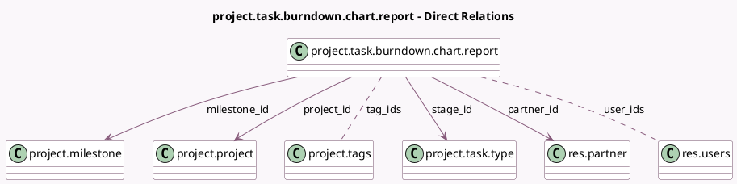

<!-- GENERATED:MODEL -->
---
tags: [odoo, community, generated, model]
---

# project.task.burndown.chart.report

- Module: [[docs/Community Addons/project/project|project]]
- Scope: Community Addons
- Defined in module: yes
- Source files: `report/project_task_burndown_chart_report.py`
- Python classes: `ProjectTaskBurndownChartReport`
- Description: Burndown Chart

## Field footprint

- Detected fields: 13
- Field types: `Date` x 2, `Datetime` x 2, `Float` x 1, `Many2many` x 2, `Many2one` x 4, `Selection` x 2
- Relation fields: 6

## Sample fields

- `allocated_hours`: `Float`
- `date`: `Datetime` (comodel `Date`)
- `date_assign`: `Datetime`
- `date_deadline`: `Date`
- `date_last_stage_update`: `Date`
- `is_closed`: `Selection`
- `milestone_id`: `Many2one` (comodel `project.milestone`)
- `partner_id`: `Many2one` (comodel `res.partner`)
- `project_id`: `Many2one` (comodel `project.project`)
- `stage_id`: `Many2one` (comodel `project.task.type`)
- `state`: `Selection`
- `tag_ids`: `Many2many` (comodel `project.tags`)
- `user_ids`: `Many2many` (comodel `res.users`)

## Method hints

- Detected methods: 6
- Action methods: none
- Compute methods: none
- Onchange methods: none

## Direct relation diagram

## Navigation

- **Parent:** [[docs/Community Addons/project/Models]]

<!-- GENERATED:MODEL -->
