<!-- GENERATED:MODEL -->
---
tags: [odoo, community, generated, model]
---

# project.task

- Module: [[docs/Community Addons/project/project|project]]
- Scope: Community Addons
- Defined in module: yes
- Source files: `models/project_task.py`
- Python classes: `ProjectTask`
- Description: Task
- Inherits: `html.field.history.mixin`, `mail.activity.mixin`, `mail.thread.cc`, `mail.tracking.duration.mixin`, `portal.mixin`, `rating.mixin`

## Field footprint

- Detected fields: 72
- Field types: `Boolean` x 15, `Char` x 7, `Date` x 1, `Datetime` x 6, `Float` x 7, `Html` x 1, `Integer` x 10, `Many2many` x 6, `Many2one` x 10, `One2many` x 3, `Properties` x 1, `Selection` x 5
- Relation fields: 19

## Sample fields

- `active`: `Boolean`
- `allocated_hours`: `Float` (comodel `Allocated Time`)
- `allow_milestones`: `Boolean` (related `project_id.allow_milestones`)
- `allow_recurring_tasks`: `Boolean` (related `project_id.allow_recurring_tasks`)
- `allow_task_dependencies`: `Boolean` (related `project_id.allow_task_dependencies`)
- `attachment_ids`: `One2many` (comodel `ir.attachment`, compute `_compute_attachment_ids`)
- `child_ids`: `One2many` (comodel `project.task`)
- `closed_depend_on_count`: `Integer` (compute `_compute_depend_on_count`)
- `closed_subtask_count`: `Integer` (comodel `Closed Sub-tasks Count`, compute `_compute_subtask_count`)
- `color`: `Integer`
- `company_id`: `Many2one` (comodel `res.company`, compute `_compute_company_id`, store `True`)
- `create_date`: `Datetime` (comodel `Created On`)
- `current_user_same_company_partner`: `Boolean` (compute `_compute_current_user_same_company_partner`)
- `date_assign`: `Datetime`
- `date_deadline`: `Datetime`
- `date_end`: `Datetime`
- `date_last_stage_update`: `Datetime`
- `depend_on_count`: `Integer` (compute `_compute_depend_on_count`)
- `depend_on_ids`: `Many2many` (comodel `project.task`)
- `dependent_ids`: `Many2many` (comodel `project.task`)

## Method hints

- Detected methods: 141
- Action methods: `action_archive`, `action_convert_to_subtask`, `action_convert_to_template`, `action_create_from_template`, `action_dependent_tasks`, `action_open_parent_task`, `action_open_ratings`, `action_open_task`, and 9 more
- Compute methods: `_compute_access_url`, `_compute_attachment_ids`, `_compute_company_id`, `_compute_current_user_same_company_partner`, `_compute_depend_on_count`, `_compute_dependent_tasks_count`, `_compute_display_follow_button`, `_compute_display_in_project`, and 19 more
- Onchange methods: `_onchange_project_id`, `_onchange_task_company`

## Direct relation diagram

```plantuml
@startuml
!define ODOO_COLOR_PRIMARY #714B67
!define ODOO_COLOR_ACCENT #875A7B
!define ODOO_COLOR_BG #FAF7FA

skinparam backgroundColor ODOO_COLOR_BG
skinparam defaultTextAlignment left
skinparam ArrowColor ODOO_COLOR_ACCENT
skinparam ClassBackgroundColor white
skinparam ClassBorderColor ODOO_COLOR_PRIMARY
skinparam ComponentBackgroundColor white
skinparam ComponentBorderColor ODOO_COLOR_PRIMARY
skinparam NoteBackgroundColor #FFF8FF
skinparam NoteBorderColor ODOO_COLOR_ACCENT
skinparam SequenceLifeLineBorderColor ODOO_COLOR_ACCENT
skinparam SequenceLifeLineBackgroundColor #FFFFFF
skinparam SequenceParticipantBorderColor ODOO_COLOR_PRIMARY
skinparam SequenceParticipantBackgroundColor #FFFFFF
skinparam sequence {
  ArrowColor ODOO_COLOR_ACCENT
  ActorBorderColor ODOO_COLOR_PRIMARY
}
title project.task - Direct Relations
class "project.task" as project_task
class "ir.attachment" as ir_attachment
class "project.milestone" as project_milestone
class "project.project" as project_project
class "project.role" as project_role
class "project.tags" as project_tags
class "project.task" as project_task
class "project.task.recurrence" as project_task_recurrence
class "project.task.stage.personal" as project_task_stage_personal
class "project.task.type" as project_task_type
class "res.company" as res_company
class "res.partner" as res_partner
class "res.users" as res_users
project_task --> project_task_type : stage_id
project_task .. project_tags : tag_ids
project_task --> project_project : project_id
project_task .. project_role : role_ids
project_task .. res_users : user_ids
project_task .. project_task_type : personal_stage_type_ids
project_task --> project_task_stage_personal : personal_stage_id
project_task --> project_task_type : personal_stage_type_id
project_task --> res_partner : partner_id
project_task --> res_company : company_id
project_task --|> ir_attachment : attachment_ids
project_task --> ir_attachment : displayed_image_id
project_task --> project_task : parent_id
project_task --|> project_task : child_ids
project_task --> project_milestone : milestone_id
project_task .. project_task : depend_on_ids
project_task .. project_task : dependent_ids
@enduml
```

## Navigation

- **Parent:** [[docs/Community Addons/project/Models]]

<!-- GENERATED:MODEL -->
