<!-- GENERATED:MODEL -->
---
tags: [odoo, community, generated, model]
---

# project.task.recurrence

- Module: [[docs/Community Addons/project/project|project]]
- Scope: Community Addons
- Defined in module: yes
- Source files: `models/project_task_recurrence.py`
- Python classes: `ProjectTaskRecurrence`
- Description: Task Recurrence

## Field footprint

- Detected fields: 5
- Field types: `Date` x 1, `Integer` x 1, `One2many` x 1, `Selection` x 2
- Relation fields: 1

## Sample fields

- `repeat_interval`: `Integer`
- `repeat_type`: `Selection`
- `repeat_unit`: `Selection`
- `repeat_until`: `Date`
- `task_ids`: `One2many` (comodel `project.task`)

## Method hints

- Detected methods: 8
- Action methods: none
- Compute methods: none
- Onchange methods: none

## Direct relation diagram

```plantuml
@startuml
!define ODOO_COLOR_PRIMARY #714B67
!define ODOO_COLOR_ACCENT #875A7B
!define ODOO_COLOR_BG #FAF7FA

skinparam backgroundColor ODOO_COLOR_BG
skinparam defaultTextAlignment left
skinparam ArrowColor ODOO_COLOR_ACCENT
skinparam ClassBackgroundColor white
skinparam ClassBorderColor ODOO_COLOR_PRIMARY
skinparam ComponentBackgroundColor white
skinparam ComponentBorderColor ODOO_COLOR_PRIMARY
skinparam NoteBackgroundColor #FFF8FF
skinparam NoteBorderColor ODOO_COLOR_ACCENT
skinparam SequenceLifeLineBorderColor ODOO_COLOR_ACCENT
skinparam SequenceLifeLineBackgroundColor #FFFFFF
skinparam SequenceParticipantBorderColor ODOO_COLOR_PRIMARY
skinparam SequenceParticipantBackgroundColor #FFFFFF
skinparam sequence {
  ArrowColor ODOO_COLOR_ACCENT
  ActorBorderColor ODOO_COLOR_PRIMARY
}
title project.task.recurrence - Direct Relations
class "project.task.recurrence" as project_task_recurrence
class "project.task" as project_task
project_task_recurrence --|> project_task : task_ids
@enduml
```

## Navigation

- **Parent:** [[docs/Community Addons/project/Models]]

<!-- GENERATED:MODEL -->
