<!-- GENERATED:MODEL -->
---
tags: [odoo, community, generated, model]
---

# project.task.stage.personal

- Module: [[docs/Community Addons/project/project|project]]
- Scope: Community Addons
- Defined in module: yes
- Source files: `models/project_task_stage_personal.py`
- Python classes: `ProjectTaskStagePersonal`
- Description: Personal Task Stage

## Field footprint

- Detected fields: 3
- Field types: `Many2one` x 3
- Relation fields: 3

## Sample fields

- `stage_id`: `Many2one` (comodel `project.task.type`)
- `task_id`: `Many2one` (comodel `project.task`)
- `user_id`: `Many2one` (comodel `res.users`)

## Method hints

- Detected methods: 0
- Action methods: none
- Compute methods: none
- Onchange methods: none

## Direct relation diagram

```plantuml
@startuml
!define ODOO_COLOR_PRIMARY #714B67
!define ODOO_COLOR_ACCENT #875A7B
!define ODOO_COLOR_BG #FAF7FA

skinparam backgroundColor ODOO_COLOR_BG
skinparam defaultTextAlignment left
skinparam ArrowColor ODOO_COLOR_ACCENT
skinparam ClassBackgroundColor white
skinparam ClassBorderColor ODOO_COLOR_PRIMARY
skinparam ComponentBackgroundColor white
skinparam ComponentBorderColor ODOO_COLOR_PRIMARY
skinparam NoteBackgroundColor #FFF8FF
skinparam NoteBorderColor ODOO_COLOR_ACCENT
skinparam SequenceLifeLineBorderColor ODOO_COLOR_ACCENT
skinparam SequenceLifeLineBackgroundColor #FFFFFF
skinparam SequenceParticipantBorderColor ODOO_COLOR_PRIMARY
skinparam SequenceParticipantBackgroundColor #FFFFFF
skinparam sequence {
  ArrowColor ODOO_COLOR_ACCENT
  ActorBorderColor ODOO_COLOR_PRIMARY
}
title project.task.stage.personal - Direct Relations
class "project.task.stage.personal" as project_task_stage_personal
class "project.task" as project_task
class "project.task.type" as project_task_type
class "res.users" as res_users
project_task_stage_personal --> project_task : task_id
project_task_stage_personal --> res_users : user_id
project_task_stage_personal --> project_task_type : stage_id
@enduml
```

## Navigation

- **Parent:** [[docs/Community Addons/project/Models]]

<!-- GENERATED:MODEL -->
