<!-- GENERATED:MODEL -->
---
tags: [odoo, community, generated, model]
---

# project.task.type

- Module: [[docs/Community Addons/project/project|project]]
- Scope: Community Addons
- Defined in module: yes
- Source files: `models/project_task_type.py`
- Python classes: `ProjectTaskType`
- Description: Task Stage

## Field footprint

- Detected fields: 15
- Field types: `Boolean` x 4, `Char` x 1, `Datetime` x 1, `Integer` x 3, `Many2many` x 1, `Many2one` x 3, `Selection` x 2
- Relation fields: 4

## Sample fields

- `active`: `Boolean` (comodel `Active`)
- `auto_validation_state`: `Boolean` (comodel `Automatic Kanban Status`)
- `color`: `Integer`
- `fold`: `Boolean`
- `mail_template_id`: `Many2one` (comodel `mail.template`)
- `name`: `Char`
- `project_ids`: `Many2many` (comodel `project.project`)
- `rating_active`: `Boolean` (comodel `Send a customer rating request`)
- `rating_request_deadline`: `Datetime` (compute `_compute_rating_request_deadline`, store `True`)
- `rating_status`: `Selection`
- `rating_status_period`: `Selection`
- `rating_template_id`: `Many2one` (comodel `mail.template`)
- `rotting_threshold_days`: `Integer` (comodel `Days to rot`)
- `sequence`: `Integer`
- `user_id`: `Many2one` (comodel `res.users`, compute `_compute_user_id`, store `True`)

## Method hints

- Detected methods: 12
- Action methods: `action_unarchive`
- Compute methods: `_compute_rating_request_deadline`, `_compute_user_id`
- Onchange methods: none

## Direct relation diagram

```plantuml
@startuml
!define ODOO_COLOR_PRIMARY #714B67
!define ODOO_COLOR_ACCENT #875A7B
!define ODOO_COLOR_BG #FAF7FA

skinparam backgroundColor ODOO_COLOR_BG
skinparam defaultTextAlignment left
skinparam ArrowColor ODOO_COLOR_ACCENT
skinparam ClassBackgroundColor white
skinparam ClassBorderColor ODOO_COLOR_PRIMARY
skinparam ComponentBackgroundColor white
skinparam ComponentBorderColor ODOO_COLOR_PRIMARY
skinparam NoteBackgroundColor #FFF8FF
skinparam NoteBorderColor ODOO_COLOR_ACCENT
skinparam SequenceLifeLineBorderColor ODOO_COLOR_ACCENT
skinparam SequenceLifeLineBackgroundColor #FFFFFF
skinparam SequenceParticipantBorderColor ODOO_COLOR_PRIMARY
skinparam SequenceParticipantBackgroundColor #FFFFFF
skinparam sequence {
  ArrowColor ODOO_COLOR_ACCENT
  ActorBorderColor ODOO_COLOR_PRIMARY
}
title project.task.type - Direct Relations
class "project.task.type" as project_task_type
class "mail.template" as mail_template
class "project.project" as project_project
class "res.users" as res_users
project_task_type .. project_project : project_ids
project_task_type --> mail_template : mail_template_id
project_task_type --> mail_template : rating_template_id
project_task_type --> res_users : user_id
@enduml
```

## Navigation

- **Parent:** [[docs/Community Addons/project/Models]]

<!-- GENERATED:MODEL -->
