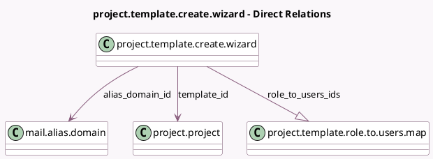

<!-- GENERATED:MODEL -->
---
tags: [odoo, community, generated, model]
---

# project.template.create.wizard

- Module: [[docs/Community Addons/project/project|project]]
- Scope: Community Addons
- Defined in module: yes
- Source files: `wizard/project_template_create_wizard.py`
- Python classes: `ProjectTemplateCreateWizard`
- Description: Project Template create Wizard

## Field footprint

- Detected fields: 8
- Field types: `Boolean` x 1, `Char` x 2, `Date` x 2, `Many2one` x 2, `One2many` x 1
- Relation fields: 3

## Sample fields

- `alias_domain_id`: `Many2one` (comodel `mail.alias.domain`)
- `alias_name`: `Char`
- `date`: `Date`
- `date_start`: `Date`
- `name`: `Char`
- `role_to_users_ids`: `One2many` (comodel `project.template.role.to.users.map`)
- `template_has_dates`: `Boolean` (compute `_compute_template_has_dates`)
- `template_id`: `Many2one` (comodel `project.project`)

## Method hints

- Detected methods: 6
- Action methods: `action_open_template_view`
- Compute methods: `_compute_template_has_dates`
- Onchange methods: none

## Direct relation diagram

## Navigation

- **Parent:** [[docs/Community Addons/project/Models]]

<!-- GENERATED:MODEL -->
