<!-- GENERATED:MODEL -->
---
tags: [odoo, community, generated, model]
---

# project.template.role.to.users.map

- Module: [[docs/Community Addons/project/project|project]]
- Scope: Community Addons
- Defined in module: yes
- Source files: `wizard/project_template_create_wizard.py`
- Python classes: `ProjectTemplateRoleToUsersMap`
- Description: Project role to users mapping

## Field footprint

- Detected fields: 3
- Field types: `Many2many` x 1, `Many2one` x 2
- Relation fields: 3

## Sample fields

- `role_id`: `Many2one` (comodel `project.role`)
- `user_ids`: `Many2many` (comodel `res.users`)
- `wizard_id`: `Many2one` (comodel `project.template.create.wizard`)

## Method hints

- Detected methods: 0
- Action methods: none
- Compute methods: none
- Onchange methods: none

## Direct relation diagram

```plantuml
@startuml
!define ODOO_COLOR_PRIMARY #714B67
!define ODOO_COLOR_ACCENT #875A7B
!define ODOO_COLOR_BG #FAF7FA

skinparam backgroundColor ODOO_COLOR_BG
skinparam defaultTextAlignment left
skinparam ArrowColor ODOO_COLOR_ACCENT
skinparam ClassBackgroundColor white
skinparam ClassBorderColor ODOO_COLOR_PRIMARY
skinparam ComponentBackgroundColor white
skinparam ComponentBorderColor ODOO_COLOR_PRIMARY
skinparam NoteBackgroundColor #FFF8FF
skinparam NoteBorderColor ODOO_COLOR_ACCENT
skinparam SequenceLifeLineBorderColor ODOO_COLOR_ACCENT
skinparam SequenceLifeLineBackgroundColor #FFFFFF
skinparam SequenceParticipantBorderColor ODOO_COLOR_PRIMARY
skinparam SequenceParticipantBackgroundColor #FFFFFF
skinparam sequence {
  ArrowColor ODOO_COLOR_ACCENT
  ActorBorderColor ODOO_COLOR_PRIMARY
}
title project.template.role.to.users.map - Direct Relations
class "project.template.role.to.users.map" as project_template_role_to_users_map
class "project.role" as project_role
class "project.template.create.wizard" as project_template_create_wizard
class "res.users" as res_users
project_template_role_to_users_map --> project_template_create_wizard : wizard_id
project_template_role_to_users_map --> project_role : role_id
project_template_role_to_users_map .. res_users : user_ids
@enduml
```

## Navigation

- **Parent:** [[docs/Community Addons/project/Models]]

<!-- GENERATED:MODEL -->
