<!-- GENERATED:MODEL -->
---
tags: [odoo, community, generated, model]
---

# project.update

- Module: [[docs/Community Addons/project/project|project]]
- Scope: Community Addons
- Defined in module: yes
- Source files: `models/project_update.py`
- Python classes: `ProjectUpdate`
- Description: Project Update
- Inherits: `mail.activity.mixin`, `mail.thread.cc`

## Field footprint

- Detected fields: 14
- Field types: `Char` x 3, `Date` x 1, `Float` x 1, `Html` x 1, `Integer` x 5, `Many2one` x 2, `Selection` x 1
- Relation fields: 2

## Sample fields

- `closed_task_count`: `Integer` (comodel `Closed Task Count`)
- `closed_task_percentage`: `Integer` (comodel `Closed Task Percentage`, compute `_compute_closed_task_percentage`)
- `color`: `Integer` (compute `_compute_color`)
- `date`: `Date`
- `description`: `Html`
- `label_tasks`: `Char` (related `project_id.label_tasks`)
- `name`: `Char` (comodel `Title`)
- `name_cropped`: `Char` (compute `_compute_name_cropped`)
- `progress`: `Integer`
- `progress_percentage`: `Float` (compute `_compute_progress_percentage`)
- `project_id`: `Many2one` (comodel `project.project`)
- `status`: `Selection`
- `task_count`: `Integer` (comodel `Task Count`)
- `user_id`: `Many2one` (comodel `res.users`)

## Method hints

- Detected methods: 11
- Action methods: none
- Compute methods: `_compute_closed_task_percentage`, `_compute_color`, `_compute_name_cropped`, `_compute_progress_percentage`
- Onchange methods: none

## Direct relation diagram

```plantuml
@startuml
!define ODOO_COLOR_PRIMARY #714B67
!define ODOO_COLOR_ACCENT #875A7B
!define ODOO_COLOR_BG #FAF7FA

skinparam backgroundColor ODOO_COLOR_BG
skinparam defaultTextAlignment left
skinparam ArrowColor ODOO_COLOR_ACCENT
skinparam ClassBackgroundColor white
skinparam ClassBorderColor ODOO_COLOR_PRIMARY
skinparam ComponentBackgroundColor white
skinparam ComponentBorderColor ODOO_COLOR_PRIMARY
skinparam NoteBackgroundColor #FFF8FF
skinparam NoteBorderColor ODOO_COLOR_ACCENT
skinparam SequenceLifeLineBorderColor ODOO_COLOR_ACCENT
skinparam SequenceLifeLineBackgroundColor #FFFFFF
skinparam SequenceParticipantBorderColor ODOO_COLOR_PRIMARY
skinparam SequenceParticipantBackgroundColor #FFFFFF
skinparam sequence {
  ArrowColor ODOO_COLOR_ACCENT
  ActorBorderColor ODOO_COLOR_PRIMARY
}
title project.update - Direct Relations
class "project.update" as project_update
class "project.project" as project_project
class "res.users" as res_users
project_update --> res_users : user_id
project_update --> project_project : project_id
@enduml
```

## Navigation

- **Parent:** [[docs/Community Addons/project/Models]]

<!-- GENERATED:MODEL -->
