<!-- GENERATED:MODEL -->
---
tags: [odoo, community, generated, model]
---

# report.project.task.user

- Module: [[docs/Community Addons/project/project|project]]
- Scope: Community Addons
- Defined in module: yes
- Source files: `report/project_report.py`
- Python classes: `ReportProjectTaskUser`
- Description: Tasks Analysis

## Field footprint

- Detected fields: 33
- Field types: `Boolean` x 5, `Char` x 1, `Datetime` x 5, `Float` x 7, `Integer` x 1, `Many2many` x 4, `Many2one` x 7, `Selection` x 2, `Text` x 1
- Relation fields: 11

## Sample fields

- `company_id`: `Many2one` (comodel `res.company`)
- `create_date`: `Datetime` (comodel `Create Date`)
- `date_assign`: `Datetime`
- `date_deadline`: `Datetime`
- `date_end`: `Datetime`
- `date_last_stage_update`: `Datetime`
- `delay_endings_days`: `Float`
- `dependent_ids`: `Many2many` (comodel `project.task`)
- `description`: `Text`
- `display_in_project`: `Boolean`
- `has_template_ancestor`: `Boolean`
- `is_closed`: `Boolean`
- `is_template`: `Boolean`
- `message_is_follower`: `Boolean` (related `task_id.message_is_follower`)
- `milestone_id`: `Many2one` (comodel `project.milestone`)
- `name`: `Char`
- `nbr`: `Integer` (comodel `# of Tasks`)
- `parent_id`: `Many2one` (comodel `project.task`)
- `partner_id`: `Many2one` (comodel `res.partner`)
- `personal_stage_type_ids`: `Many2many` (comodel `project.task.type`)

## Method hints

- Detected methods: 5
- Action methods: none
- Compute methods: none
- Onchange methods: none

## Direct relation diagram

```plantuml
@startuml
!define ODOO_COLOR_PRIMARY #714B67
!define ODOO_COLOR_ACCENT #875A7B
!define ODOO_COLOR_BG #FAF7FA

skinparam backgroundColor ODOO_COLOR_BG
skinparam defaultTextAlignment left
skinparam ArrowColor ODOO_COLOR_ACCENT
skinparam ClassBackgroundColor white
skinparam ClassBorderColor ODOO_COLOR_PRIMARY
skinparam ComponentBackgroundColor white
skinparam ComponentBorderColor ODOO_COLOR_PRIMARY
skinparam NoteBackgroundColor #FFF8FF
skinparam NoteBorderColor ODOO_COLOR_ACCENT
skinparam SequenceLifeLineBorderColor ODOO_COLOR_ACCENT
skinparam SequenceLifeLineBackgroundColor #FFFFFF
skinparam SequenceParticipantBorderColor ODOO_COLOR_PRIMARY
skinparam SequenceParticipantBackgroundColor #FFFFFF
skinparam sequence {
  ArrowColor ODOO_COLOR_ACCENT
  ActorBorderColor ODOO_COLOR_PRIMARY
}
title report.project.task.user - Direct Relations
class "report.project.task.user" as report_project_task_user
class "project.milestone" as project_milestone
class "project.project" as project_project
class "project.tags" as project_tags
class "project.task" as project_task
class "project.task.type" as project_task_type
class "res.company" as res_company
class "res.partner" as res_partner
class "res.users" as res_users
report_project_task_user .. res_users : user_ids
report_project_task_user --> project_project : project_id
report_project_task_user --> res_company : company_id
report_project_task_user --> res_partner : partner_id
report_project_task_user --> project_task_type : stage_id
report_project_task_user --> project_task : task_id
report_project_task_user .. project_tags : tag_ids
report_project_task_user --> project_task : parent_id
report_project_task_user .. project_task_type : personal_stage_type_ids
report_project_task_user --> project_milestone : milestone_id
report_project_task_user .. project_task : dependent_ids
@enduml
```

## Navigation

- **Parent:** [[docs/Community Addons/project/Models]]

<!-- GENERATED:MODEL -->
